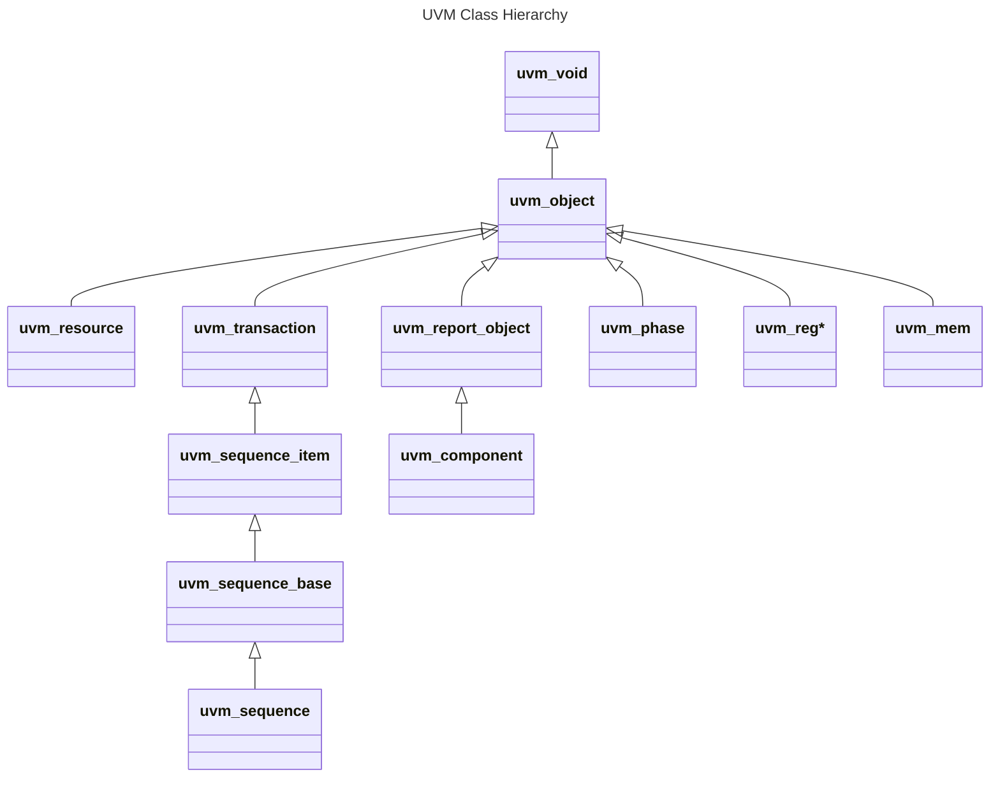
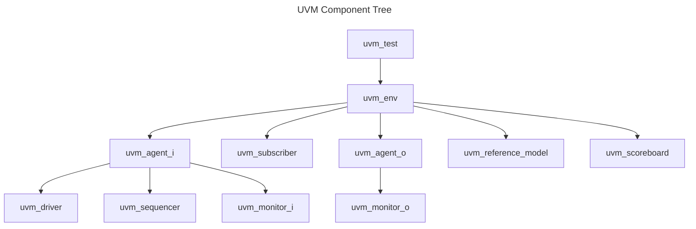
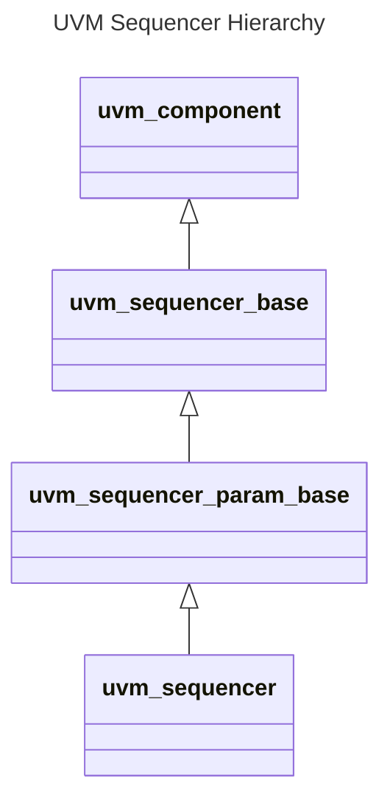
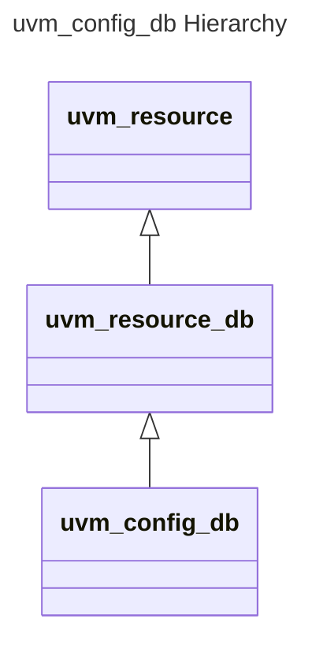
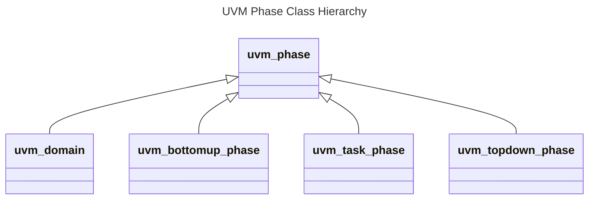
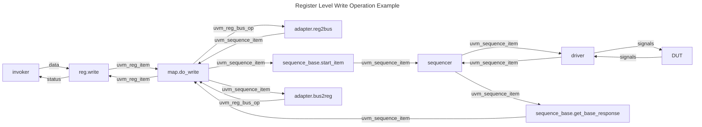
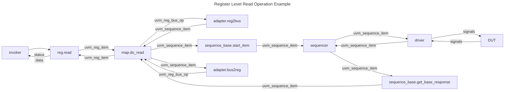

# Introduction

This note focus on the UVM application based on UVM-v1.2.


# UVM Classes Hierarchy




# UVM Architecture

In UVM verification, the testbench major functions consist of:
- Instantiate the DUT module and the UVM Test class
- Configure connections with DUT
- Start verification with desired testcases


## UVM Component Tree Structure




### UVM Root

The `uvm_root` class serves as the implicit top-level and phase controller for all UVM components.
Users do not directly instantiate `uvm_root` directly.
UVM automatically creates a single instance of `uvm_root`
accessible via the global variable `uvm_top` in `uvm_pkg`.
```systemverilog
class uvm_root extends uvm_component
```

Users could determine which test to run with the global function `uvm_root` defined in `uvm_pkg`,
which internally calls `uvm_root::run_test()`.
```systemverilog
virtual task run_test(string test_name="")
```

The `uvm_test::enable_print_topology` variable default is `0`.
If it is set, the entire testbench topology is printed just after completion of the `end_of_elaboration` phase.
Alternatively, users can explicitly call `uvm_test::print_topology()` as well.

Other responsibilities consist of:
- report server management (logging)
- integration with the factory


### UVM Test

The `uvm_test` class is a specialization of `uvm_component` that serves as the **top-level test component**.
It is instantiated automatically by `uvm_root::run_test()` when the simulation starts.
```systemverilog
virtual class uvm_test extends uvm_component
```

Major responsibilities consist of:
- verification environment instantiation (`uvm_env`)
- verification environment configuration (`uvm_env`)
- testcase invocation (`uvm_sequence`)

Typically, there is one **base `uvm_test` class** sets up the general environment and invoke the base sequence.
Other individual tests extend this base class and customize the environment, configuration, and sequences.


### UVM Environment

A environment is a container component that **groups verification components** into a single reusable block.
It typically contains agents (`uvm_agent`), scoreboards (`uvm_scoreboard`), coverage collectors (`uvm_subscriber`),
reference models (`uvm_component`), or even other sub-environments.
The declaration of the `uvm_env` is as follows:
```systemverilog
virtual class uvm_env extends uvm_component
```

Major responsibilities consist of:
- verification components instantiation
- verification components configuration
- verification components connection
- as a reusable block which can be instantiated in other tests


### UVM Agent

An agent is a container for all verification components related to a **single DUT interface**.
It usually contains sequencers, drivers, and monitors.
The declaration of the `uvm_agent` is as follows:
```systemverilog
virtual class uvm_agent extends uvm_component
```

`uvm_agent` operates in either **active** or **passive** mode.
The `is_active` is an `uvm_active_passive_enum` enumerate type variable in `uvm_agent`.
It can be used in `uvm_agent` to determine whether drivers and sequencers are active.
The definition of `uvm_active_passive_enum` type is as follows:
```systemverilog
typedef enum bit {UVM_PASSIVE=0, UVM_ACTIVE=1} uvm_active_passive_enum;
```
Active agents instantiate sequencers, drivers, and monitors, which drive the DUT and observe DUT signals.
Passive agents only instantiate monitors and observe DUT signals.

The `seq_item_port` in `uvm_driver` must be connected to `seq_item_export` in `uvm_sequencer` during connect phase.
The analysis port in monitor might be connected to the analysis port in agent for further connections upper environment.


### UVM Driver

A driver is responsible for **driving sequence items onto DUT interfaces**.
It fetches transactions from the sequencer via the `seq_item_port`,
translates them into pin-level activity or bus transactions.
If necessary, it returns responses back to the sequencer.
The declaration of `uvm_driver` is as follows:
```systemverilog
class uvm_driver #(type REQ = uvm_sequence_item, type RSP = REQ) extends uvm_component
```

In drivers, `seq_item_port` is used to get requests from sequencers and send responses to sequencers.
The `seq_item_port` is a `uvm_seq_item_pull_port` variable, which is defined in TLM1 extending `uvm_port_base`.
A driver fetches transactions from sequencer via `seq_item_port.get_next_item(req)`.
It send responses via one of the following styles:
- style a:
    - `rsp.set_id_info(req)`
    - `seq_item_port.put_response(rsp)`
    - `seq_item_port.item_done()`
- style b:
    - `rsp.set_id_info(req)`
    - `seq_item_port.item_done(rsp)`
`item_done()` must be called **exactly once** for each `get_next_item()` request.
There could be more than one `put_response()` invocations for more than one responses.


### UVM Monitor

A monitor is a passive component that observes DUT activities.
It convert pin-level signals into transactions, and then broadcasts those transactions to other components,
including coverage collectors, scoreboards, reference models.
The declaration of the `uvm_monitor` is as follows:
```systemverilog
virtual class uvm_monitor extends uvm_component
```

A monitor usually defines an analysis port to broadcast observed transactions.


### UVM Sequencer

A sequencer serves as an arbiter between one or more sequences and a driver.
It controls the flow of sequence items (transactions) so that only one item at a time is granted to the driver,
even if multiple sequences are running concurrently.
The class hierarchy of the `uvm_sequencer` is as follows:


The `uvm_sequencer` declaration is as follows:
```systemverilog
class uvm_sequencer #(type REQ = uvm_sequence_item, type RSP = REQ) extends uvm_sequencer_param_base #(REQ, RSP)
```

The `seq_item_export` in `uvm_sequencer` should be connected to the `seq_item_port` in `uvm_driver`.
The `seq_item_export` is a `uvm_seq_item_pull_export` variable, which is defined in TLM1 extending `uvm_port_base`.


#### Default Sequence

The default sequence is a sequence that a sequencer automatically starts when the run phase begins,
unless another sequence is explicitly started by `uvm_sequence::start()`.
`default_sequence` is a protected string variable declared in `uvm_sequencer_base`, representing the default sequence type name.
It is usually configured via the `uvm_config_db::set()` method.

#### Sequence Arbitration

When multiple sequences are started on the same sequencer,
The sequencer must arbitrate which sequence's request to grant to the driver.
The arbitration policy is set using:
```systemverilog
function void set_arbitration(
    UVM_SEQ_ARB_TYPE val)
```

The definition of the `UVM_SEQ_ARB_TYPE` enumerate type is as follows:
```systemverilog
typedef enum {
    UVM_SEQ_ARB_FIFO,
    UVM_SEQ_ARB_WEIGHTED,
    UVM_SEQ_ARB_RANDOM,
    UVM_SEQ_ARB_STRICT_FIFO,
    UVM_SEQ_ARB_STRICT_RANDOM,
    UVM_SEQ_ARB_USER
} uvm_sequencer_arb_mode;

typedef uvm_sequencer_arb_mode UVM_SEQ_ARB_TYPE;
```
- `UVM_SEQ_ARB_FIFO`: default, requests are granted in FIFO order.
- `UVM_SEQ_ARB_WEIGHTED`: requests are granted randomly by weight.
- `UVM_SEQ_ARB_RANDOM`: requests are granted randomly.
- `UVM_SEQ_ARB_STRICT_FIFO`: requests at highest priority are granted in FIFO order.
- `UVM_SEQ_ARB_STRICT_RANDOM`: requests at highest priority are granted randomly.
- `UVM_SEQ_ARB_USER`: arbitration is delegated to user-defined function `user_priority_arbitration`.


#### Virtual Sequencer

A virtual sequencer is a sequencer that does **not directly communicate with a driver**.
Instead, it holds handles to other "real" sequencers in the environment,
allowing a virtual sequence to control multiple sequencers (and thus multiple interfaces) in a coordinate way.
This is especially useful in system-level scenarios where multiple interfaces must act together.


### UVM Coverage Collector

A coverage collector is typically a user-defined class that extends the `uvm_subscriber` class.
It connects to a monitor's analysis port and receives transactions for coverage sampling.
The declaration of the `uvm_subscriber` is as follows:
```systemverilog
class uvm_subscriber #(type T=int) extends uvm_component
```

There are a `uvm_analysis_imp analysis_export` variable and a **pure virtual** `write()` method defined in `uvm_subscriber`.
The `write()` method must be defined in user defined class to support `analysis_export`.
These members process transactions from analysis port and trigger coverage sample.


### UVM Scoreboard

A scoreboard is a checking component that validates DUT functionality by
comparing actual output transactions with expected transactions.
The declaration of the `uvm_scoreboard` is as follows:
```systemverilog
virtual class uvm_scoreboard extends uvm_component
```

Major steps of `uvm_scoreboard` to check the DUT behaviors:
- receives input and output transactions from agent through analysis ports
- gets reference output transactions by either:
    - runs input transaction with reference model
    - receives expected transactions from reference model
- compares actual output transactions and expected output transactions
- reports mismatches using UVM reporting machanism.


### Reference Model

There is no built-in UVM component for a reference model.
User should define a customized reference model as a class which extends the `uvm_component` class.

Major operation steps of reference models:
- receives observed input transactions from input monitor
- processes input transactions and generates expected transactions
- sends output expected transactions to scoreboard


# UVM Transaction

A transaction is a user-defined data object that extends the `uvm_sequence_item` class.
Transactions are used to represent stimulus (from sequences to drivers),
response (from drivers to sequences), or observed outputs from monitors.
The declaration of `uvm_sequence_item` is as follows:
```systemverilog
class uvm_sequence_item extends uvm_transaction
```

Customized transaction class derived from `usm_sequnce_item` can take advantages of the field automation mechanism.
It automatically implement common methods for printing, copying, comparing, and packing/unpacking.


# UVM Sequence

A sequence is used to generate stimulus transactions and send them to a sequencer.
The declaration of the `uvm_sequence` is as follows:
```systemverilog
virtual class uvm_sequence #(type REQ = uvm_sequence_item, type RSP = REQ) extends uvm_sequence_base
```

`uvm_sequence` can operate hierarchically,
which means a parent sequence can start child sequences on the same or different sequencers.
This enables complex stimulus generating by composing smaller reusable sequences.


## Testcase Generation and Send

The `body()` task is defined in `uvm_sequence_base` and inherited by `uvm_sequence`.
Users override this task to describe stimulus generation and transaction sending.
The declaration of the `body()` method is as:
```systemverilog
virtual task body()
```


### Method Based

In method-based style, users explicitly create transactions
and use `start_item()`/`finish_item()` to send them to the sequencer.
Typical flow is as follows:
- instantiate transaction
- randomize or customize transaction
- call `start_item()`
- call `finish_item()`

Relevant methods:
- `virtual task start_item(uvm_sequence_item item,int priority=-1, uvm_sequencer_base sequencer=null)`<br>
    Declared in the `uvm_sequence_base`.
- `virtual task pre_do(bit is_item)`<br>
    Declared in the `uvm_sequence_base`.
    The last code in `start_item`, could be reloaded.
- `virtual task finish_item(uvm_sequence_item item, int priority=-1)`<br>
    Declared in the `uvm_sequence_base`.
- `virtual function void mid_do(uvm_sequence_item this_item)`<br>
    Declared in the `uvm_sequence_base`.
    The first code in `finish_item`, could be reloaded.
- `virtual function void post_do(uvm_sequence_item this_item)`<br>
    Declared in the `uvm_sequence_base`.
    The last code in `finish_item`, could be reloaded.


### uvm\_do Macros Based

UVM provides a set of `uvm_do` macros to simplify transaction creation, randomization, and sending.
These macros encapsulate the method-based invocations into a single statement.
The macros include:
```systemverilog
`uvm_do(SEQ_OR_ITEM)
`uvm_do_with(SEQ_OR_ITEM, CONSTRAINTS)
`uvm_do_pri(SEQ_OR_ITEM, PRIORITY)
`uvm_do_pri_with(SEQ_OR_ITEM, CONSTRAINTS, PRIORITY)
`uvm_do_on(SEQ_OR_ITEM, SEQR)
`uvm_do_on_with(SEQ_OR_ITEM, CONSTRAINTS, SEQR)
`uvm_do_on_pri(SEQ_OR_ITEM, PRIORITY, SEQR)
`uvm_do_on_pri_with(SEQ_OR_ITEM, CONSTRAINTS, PRIORITY, SEQR)
```
- `SEQ_OR_ITEM`<br>
    - is a transaction: the macros will create transaction instance, randomize it, and send it to sequencer.
    - is a sequence: the `start()` method of the sequence will be called.
- `CONSTRAINTS`: inline randomization constraints.
- `PRIORITY`: arbitration priority, default: -1.
- `SEQR`: sequencer handler, to explicitly appoint sequencer.

The `SEQ_OR_ITEM` argument used as sequence and the `` `uvm_do_on* `` macros
are mainly used in [virtual sequences](#virtual-sequence).


### uvm\_create and uvm\_send Macros Based

`uvm_create` and `uvm_send` macros provide an alternative, more flexible way to
generate and send transactions or sequences.
Compared with `uvm_do` macros, this split form allows inserting user-defined operations between create and send.

Create macros are as follows:
```systemverilog
`uvm_create(SEQ_OR_ITEM)
`uvm_create_on(SEQ_OR_ITEM, SEQR)
```
- `SEQ_OR_ITEM`<br>
    - is a transaction: create the item using the factory.
    - is a sequence: create the sequence object via factory.
- `SEQR`: sequencer handler, to explicitly appoint sequencer.

Send macros are as follows:
```systemverilog
`uvm_send(SEQ_OR_ITEM)
`uvm_send_pri(SEQ_OR_ITEM, PRIORITY)
`uvm_rand_send(SEQ_OR_ITEM)
`uvm_rand_send_pri(SEQ_OR_ITEM, PRIORITY)
`uvm_rand_send_with(SEQ_OR_ITEM, CONSTRAINTS)
`uvm_rand_send_pri_with(SEQ_OR_ITEM, PRIORITY, CONSTRAINTS)
```
These macros send the item/sequence created by create macros to the sequencer.
- `CONSTRAINTS`: inline randomization constraints.
- `PRIORITY`: arbitration priority, default: -1.

The `SEQ_OR_ITEM` argument used as sequence and the `` `uvm_create_on `` macro
are mainly used in [virtual sequences](#virtual-sequence).


## Start Sequence

The `start()` task declared in `uvm_sequence_base` is used to start a sequence on a specific sequencer.
The declaration of the `start()` method is as follows:
```systemverilog
virtual task start(
    uvm_sequencer_base  sequencer,
    uvm_sequence_base   parent_sequence=null,
    int                 this_priority=-1,
    bit                 call_pre_post=1)
```

- `sequencer`<br>
    The sequencer on which this sequence should run.
- `parent_sequence`<br>
    - If specified, the method invoking sequence is considered a child sequence.
        And the `pre_do`, `mid_do`, and `post_do` methods of the `parent_sequence` will be called.
    - If not specified, it's a root sequence.
- `this_priority`<br>
    - If is `-1`
        - child sequence: inherits priority from parent sequence
        - parent sequence: priority is 100.
    - Otherwise, priority is as given.
- `call_pre_post`<br>
    Decides whether the `pre_body` and `post_body` will be called.


## Sequence Enable

During sequencer arbitration, the `is_relevant` method of each active sequence is called.
The declaration of the `is_relevant` method in `uvm_sequence_base` is as:
```systemverilog
virtual function bit is_relevant()
```
If it returns 1, the sequence is eligible for arbitration.
Otherwise, the sequence is disabled.

User could override the `is_relevant` function to determine the sequence activity.


## Sequence Lock & Grab

When multiple sequences are running on the same sequencer,
`lock()` and `grab()` provide a way to give one sequence exclusive access to that sequencer.

Relevant methods in `uvm_sequence_base`:
- `task lock(uvm_sequencer_base sequencer=null)`<br>
    Requests a lock on the specified `sequencer`.
    If sequencer is null, the lock will be requested on the current default sequencer.
    A lock request will be arbitrated the same as any other request.
    A lock is granted after all earlier requests are completed and no other locks or grabs are blocking this sequence.
    The lock call will return when the lock has been granted.
- `function void unlock(uvm_sequencer_base sequencer=null)`<br>
    Removes any locks or grabs obtained by this sequence on the specified sequencer.
    If sequencer is null, then the unlock will be done on the current default sequencer.
- `task grab(uvm_sequencer_base sequencer=null)`<br>
    Requests a lock on the specified `sequencer`.
    If no argument is supplied, the lock will be requested on the current default sequencer.
    A grab request is put in front of the arbitration queue. It will be arbitrated before any other requests.
    A grab is granted when no other grabs or locks are blocking this sequence.
    The grab call will return when the grab has been granted.
- `function void ungrab(uvm_sequencer_base sequencer=null)`<br>
    Removes any locks or grabs obtained by this sequence on the specified sequencer.
    If sequencer is null, then the unlock will be done on the current default sequencer.


## Sequencer Pointer

In a sequence, there are 2 common ways to access the sequencer: m\_sequencer and p\_sequencer.

`m_sequencer` is a protected **`uvm_sequencer_base`** variable declared in `uvm_sequence_base`.
It is automatically assigned to the sequencer argument in the `start()`.
Member methods and variables defined in `uvm_sequencer_base` could be accessed via `m_sequencer`.

`p_sequencer` is a **user-defined `<sequencer_type>`** variable.
It is declared in the sequence with the macro:
```systemverilog
`uvm_declare_p_sequencer(<sequencer_type>)
```
In `uvm_sequence_base::pre_body()`,
`m_sequencer` is type-case to the correct `<sequencer_type>` and assigned to `p_sequencer`.
It gives direct access to the user-defined sequencer's methods and variables.


## Response

Sequences could process with response from drivers.
`get_response()` works with the `seq_item_port.put_response()` in driver,
which is declared in `uvm_sequence`:
```systemverilog
virtual task get_response(
    output  RSP response,
    input   int transaction_id=-1)
```
This method is invoked in the `body()` method.
If a `transaction_id` is specified,
the task will block until a response with that `transaction_id` is received in the response queue.
If no `transaction_id` is specified,
this task will block until the next response is sent to this sequence.
The default size of the response queue is 8 (configurable via sequencer).
The `get_response()` method must be called soon enough to avoid
an overflow of the response queue to prevent responses from being dropped.

If there are more than one responses for a transaction,
the `get_response()` methods should called multiple times to get all responses.

Instead of polling `get_response()` in the `body()` method, sequences can use a response handler mechanism.
- `function void use_response_handler(bit enable)`<br>
    This is a method declared in `uvm_sequence_base`.
    When called with enable set to 1, responses will be sent to the response handler.
    Otherwise, responses must be retrieved using `get_response()`.
- `virtual function void response_handler(uvm_sequence_item reponse)`<br>
    This is a method declared in `uvm_sequence_base`.
    When the `use_response_handler` bit is set to 1,
    this virtual task is called by the sequencer for each response that arrives for this sequence.
    User could customize process for responses in this function.


## Virtual Sequence


A virtual sequence is a sequence that does not directly generate transactions for a driver.
Instead, it  controls the execution of other sequences (sub-sequences) typically across a virtual sequencer.

Sub-sequences can be started with sequencer argument indicated by `q_sequencer.<seqr>`,
where `q_sequencer` is the virtual sequencer.


## Sequence Library

A sequence library is a collection of sequences.
When started like a normal sequence,
the sequence library selects and executes sequences inside it
according to a selection algorithm and for a specified number of iterations.

A sequence library definition example is as follows:
```systemverilog
class my_seq_lib extends uvm_sequence_library #(my_transction)
    `uvm_object_utils(my_seq_lib)
    `uvm_sequence_library_utils(my_seq_lib)

    function new(string name="my_seq_lib");
        super.new(name);
        init_sequence_library();
    endfunction
endclass
```

- `` `uvm_object_utils(TYPE) ``<br>
    Register the library with the UVM factory.
- `` `uvm_sequence_library_utils(TYPE) ``<br>
    Add the necessary infrastructure to manage contained sequences.
- `init_sequence_library()`<br>
    Must be called in every child of `uvm_sequence_library` to initialize the internal data structures.

To add a sequence into a a sequence library, use the macro:
```systemverilog
`uvm_add_to_seq_lib(TYPE, LIBTYPE)
```
This macro is placed in sequence class definition, similar to `` `uvm_object_utils(TYPE) ``.


### Sequence Selection

The sequence selection algorithm is controlled by the variable `selection_mode` in `uvm_sequence_library`,
whose type is `uvm_sequence_lib_mode`.
The definition of the `uvm_sequence_lib_mode` type is as follows:
```systemverilog
typedef enum {
    UVM_SEQ_LIB_RAND,
    UVM_SEQ_LIB_RANDC,
    UVM_SEQ_LIB_ITEM,
    UVM_SEQ_LIB_USER
} uvm_sequence_lib_mode;
```
- `UVM_SEQ_LIB_RAND`: random sequence selection
- `UVM_SEQ_LIB_RANDC`: cyclic random sequence selection
- `UVM_SEQ_LIB_ITEM`: emit only items as normal sequence, no sequence execution
- `UVM_SEQ_LIB_USER`: apply a user-defined selection algorithm

To implement a custom selection algorithm, override the `select_sequence()` method in `uvm_sequence_library`:
```systemverilog
virtual function int unsigned select_sequence(int unsigned max)
```
`max` is the number of sequences registered in the library.
It returns an index used to select the next sequence to execute.


### Execution Time

In a sequence library, the number of times sequences (or items) are executed is controlled by two variables:
- `int unsigned min_random_count = 10`
- `int unsigned max_random_count = 10`
At runtime, the sequence library will randomly choose an iteration count `N` meets
`min_random_count <= N <= max_random_count`.
Then it will execute `N` sequences (or items) according to the current selection algorithm.


### uvm\_sequence\_library\_cfg

In `uvm_sequence_library`, the `uvm_sequence_library_cfg config` variable
stores configuration settings that control how the library executes.
Main configurable fields:
- `selection_mode`
- `min_random_count`
- `max_random_count`
`config` is created automatically when the sequence library is constructed.
Users could override it in the constructor or adjust it dynamically before starting the library.
It is equivalent to directly assigning these fields, but using `config` keeps all settings in one place.


<!--
TODO
Continue to review and refine below.
BY lshi1 AT 2025-09-04 17:24
-->

# UVM TLM1

The TLM1 ports provide blocking and non-blocking pass-by-value transaction-level Communications.
The semantics of these communications are limited to message passing.


## Communications

6 types of communications:
- put,
    used to send, or put transactions to other components.
- get,
    used to retrieve and consume transactions from other components.
- peek,
    used to retrieve transactions from other components without consuming.
- transport, used to send a request transaction and returns a response transaction in a task call.
- master and slave, combination of put, get, or peek.
    - master, puts requests and gets or peeks responses
    - slave, gets or peeks requests and puts responses.
- analysis, used to perform non-blocking broadcasts of transactions to connected components.


## Ports

Ports are the basis of TLM communications implementation.
3 types of ports:
- `port`,
    instantiated in components that use the associate communication to initiate transaction request.
- `export`,
    instantiated in components that forward an implementation of the methods defined in the associate communication.
- `imp`,
    instantiated by components that provide or implement methods defined in the associate communication.

Declarations of ports for put, get, peek and analysis:
```systemverilog
class uvm_*_port #(type T=int) extends uvm_port_base #(tlm_if_base #(T, T));
class uvm_*_export #(type T=int) extends uvm_port_base #(tlm_if_base #(T, T));
class uvm_*_imp #(type T=int) extends uvm_port_base #(tlm_if_base #(T, T));
```

The `*` could be one of:
- `blocking_put`
- `nonblocking_put`
- `put`
- `blocking_get`
- `nonblocking_get`
- `get`
- `blocking_peek`
- `nonblocking_peek`
- `peek`
- `blocking_get_peek`
- `nonblocking_get_peek`
- `get_peek`
- `analysis`

Declarations of ports for transport, master, and slave:
```systemverilog
class uvm_*_port #(type REQ=int, RSP=int) extends uvm_port_base #(tlm_if_base #(REQ, RSP));
class uvm_*_export #(type REQ=int, RSP=int) extends uvm_port_base #(tlm_if_base #(REQ, RSP));
class uvm_*_imp #(type REQ=int, RSP=int) extends uvm_port_base #(tlm_if_base #(REQ, RSP));
```

The `*` could be one of:
- `blocking_transport`
- `nonblocking_transport`
- `transport`
- `blocking_master`
- `nonblocking_master`
- `master`
- `blocking_slave`
- `nonblocking_slave`
- `slave`


### Port Connection

The port connect method is defined in the `uvm_port_base`:
```systemverilog
virtual function void connect (this_type provider);
```
`this_type` equals to `uvm_port_base` which is defined with `typedef`.

`provider` in `connect()` method of `port` can be a `port` (transaction from child to parent), an `export`, or an `imp` instance.
`provider` in `connect()` method of `export` can be an `export` (transaction from parent to child), or an `imp` instance.

Calling transmission methods of `port` will jump to the implementation method in which component the connected `imp` exists,
no matter how far up and down the hierarchy.


### Transmission Implementation Methods

When the TLM communication is blocking type,
the class instantiating `imp` should implement relevant blocking tasks.
When the TLM communication is non-blocking type,
the class instantiating `imp` should implement relevant non-blocking functions.
When the TLM communication is both blocking and non-blocking type,
the class instantiating `imp` should implement relevant both blocking and non-blocking methods.

- blocking
    - `virtual task put(input T t)`:
        sends a transaction, for `put` communication.
    - `virtual task get(output T t)`:
        obtains a transaction, for `get` and `get_peek` communication.
    - `virtual task peek(output T t)`:
        obtains a transaction without consuming, for `peek` and `get_peek` communication.
    - `virtual task transport(input REQ t1, ouput RSP t2)`:
        sends a request transaction and returns a response transaction, for `transport` communication.
- non-blocking
    - `virtual function bit try_put(input T t)`:
        tries to send a transaction, returns 1 if successes, for `put` communication.
    - `virtual function bit can_put()`:
        returns 1 if the component is ready to accept the transaction, for `put` communication.
    - `virtual function bit try_get(output T t)`:
        tries to obtain a transaction, returns 1 if successes, for `get` and `get_peek` communication.
    - `virtual function bit can_get()`:
        returns 1 if the component is ready to accept the transaction, for `get` and `get_peek` communication.
    - `virtual function bit try_peek(output T t)`:
        tries to obtain a transaction without consuming, returns 1 if successes, for `peek` and `get_peek` communication.
    - `virtual function bit can_peek()`:
        returns 1 if the component is ready to accept the transaction, for `peek` and `get_peek` communication.
    - `virtual function bit nb_transport(input REQ t1, ouput RSP t2)`:
        tries to send a request transaction and return a response transaction, return 1 if successes, for `transport` communication.
    - `virtual function bit write(input T t)`:
        broadcasts a transaction to all listeners, for `analysis` communication.


## FIFO

`uvm_tlm_fifo #(T)` provides storage of transactions between two independently running processes.
Transactions are put into the FIFO via `*_put_export` and
popped via `*_get_export`, `*_peek_export`, or `*_get_peek_export`.

Methods:
- `function new(string name, uvm_component parent = null, int size = 1)`,
    constructs the FIFO and assign name, size, parent UVM component.
- `virtual function size()`,
    returns capacity of the FIFO.
- `virtual function used()`,
    returns the number of transactions put into the FIFO.
- `virtual function is_empty()`,
    returns 1 if no transactions in the FIFO.
- `virtual function is_full()`,
    returns 1 if number of transactions equals to the `size()`.
- `virtual function flush()`,
    removes all transactions from the FIFO, reset `used()` value.

`uvm_tlm_analysis_fifo #(T)` is a `uvm_tlm_fifo #(type T)` with an unbounded size and a analysis communication.
Typical usage is as a buffer between a `uvm_analysis_port` in an initiator component and target component.

`analysis_export #(T)` provides the write method to all connected analysis ports and parent exports.

`function new(string name, uvm_component parent = null)` is the constructor.


# UVM Mechanism


## Factory Mechanism

UVM provides factory mechanism to manage object generation.
Factory mechanism is advanced in object override after without code modification.
UVM objects and components need to be registered into factory before utilization.
After register, UVM objects and components could be override with factory methods.
`create()` method in factory will check whether the UVM objects and components to be created are overrode.
If overrode, the overrode type will be constructed.

To register a object or a component:
```systemverilog
`uvm_object_utils(<class_name>)
`uvm_object_param_utils(<class_name>)
OR
`uvm_component_utils(<class_name>)
`uvm_component_param_utils(<class_name>)
```

The `uvm_*_utils` macros will define a `uvm_object_registry` class or a `uvm_component_registry` class variable.
This variable is named as `type_id`.

To instantiate a object registered in factory mechanism:
```systemverilog
object = <class_name>::type_id::create(<name>, <parent>)
```
`create()` is a function defined both in `uvm_object_utils` and `uvm_component_utils`.
Its declaration is as follows:
```systemverilog
//  uvm_object_registry
static function T create(
    string          name="",
    uvm_component   parent=null,
    string          contxt="")

//  uvm_component_registry
static function T create(
    string          name,
    uvm_component   parent,
    string          contxt="")
```


### Type Override

After register, the name of the registered class will be added into a table managed by factory.
A type override table and a inst override table are managed by the factory as well.
Every time the `create()` is invoked, the inst override table will be looked up,
then the type override table, then the class table.
If a override record is found in the inst override table or the type override table,
a override type object will constructed and returned.

All type-override code should be executed in a parent prior to building the child(ren).
This means that environment overrides should be specified in the test.

Conditions must be satisfied for factory overriding:
- The original type and the override type must be registered into the factory.
- The object must be instantiated with the factory method.
- The override type must be a derived type of the original type.
- `uvm_component` and `uvm_object` can not be override with each other.

There are override methods in the `uvm_factory`, `uvm_obecjt_registry`, `uvm_component_registry`, and `uvm_component`.
It is recommended to use the override methods in the `uvm_obecjt_registry` or `uvm_component_registry`:

- `set_type_override()`, the normal invocation is as follows:
    ```
    <original_type>::type_id::set_type_override(
        uvm_object_wrapper  override_type,
        bit                 replace= 1)
    ```
    This is a static function defined both in  `uvm_component_registry` or `uvm_object_registry`.
    This method replaces all UVM objects or components with the new specified type.<br>
    The `override_type` is usually given as `<override_type>::get_type()`.<br>
    The second argument `replace` determines whether to replace an existing override (replace = 1).
    If this bit is 0 and an override of the given type does not exist, the override is registered with the factory.
    If this bit is 0 and an override of the given type does exist, the override is ignored.

- `set_inst_override()`, the normal invocation is as follows:
    ```
    <original_type>::type_id::set_inst_override(
        uvm_object_wrapper override_type,
        string          inst_path,
        uvm_component   parent=null)
    ```
    This is a static function defined both in  `uvm_component_registry` or `uvm_object_registry`.
    This method replaces the instance specified by the `inst_path`.<br>
    The `override_type` is usually given as `<override_type>::get_type()`.<br>
    If parent is not specified, `inst_path` is interpreted as an absolute instance path,
    which enables instance overrides to be set from outside component classes.
    If parent is specified, `inst_path` is interpreted as being relative to the parent’s hierarchical instance path,
    i.e. {`parent.get_full_name()`,”.”,`inst_path`} is the instance path that is registered with the override.


### Factory Debug

UVM also provides methods to debug factory mechanism:

- `print_override_info()`<br>
This is a function defined `uvm_component`, which has no return.
It will print the original type and the derived type.

- `factory.debug_create_by_type(
    uvm_object_wrapper  requested_type,
    string              parent_inst_path="",
    string              name="")`<br>
This method is a pure virtual function defined in the `uvm_factory`, which has no return.

- `factory.print(int all_types=1)`<br>
This method is a pure virtual function defined in the `uvm_factory`, which has no return.
`all_types` could be 0 (overrode instances and types),
1 (all messages when 0 and user defined classes which are registered into factory),
or 2 (all messages when 1 and system defined classes which are registered into factory).

- `uvm_root.print_topology(uvm_printer printer=null)`<br>
This is a function defined in the `uvm_root`, which has no return.
This method prints the topology of the UVM tree.
It should be invoked after build phase.


## config\_db Mechanism

The config\_db mechanism is implemented based on the `uvm_config_db` class.
Its class hierarchy is as follows:

The declaration of `uvm_config_db` is as follows:
```systemverilog
class uvm_config_db #(type T=int) extends uvm_resource_db #(T)
```

The config\_db mechanism is used to transfer data within a UVM test platform.
Set methods are used to send data, while get methods are used to receive data.

The following method is used to send data:
```systemverilog
uvm_config_db #(type T=int)::set(
    uvm_component   cntxt,
    string          inst_name,
    string          field_name,
    T               value);
```
This is a static function declared in the `uvm_config_db` class, which has no return.
The `cntxt` is usually be set as `this`,
which combines with the `inst_name` to indicate the instance path as {cntxt, ".", inst\_name}.
If `cntxt` is `null`, it will be replaced with `uvm_root::get()`

The following method is used to receive data:
```systemverilog
uvm_config_db #(type T=int)::get(
            uvm_component   cntxt,
            string          inst_name,
            string          field_name,
    inout   T               value);
```
This is a static function declared in the `uvm_config_db` class.
It will return a bit value indicating whether get the data successfully.
The `cntxt` is usually be set as `this`, and `inst_name` is usually be set as `""`.

The values of `field_name` in a `uvm_config_db::set()` and `uvm_config_db::get()` pair must be identical.

The following method is used to wait to receive data:
```systemverilog
uvm_config_db #(type T=int)::wait_modified(
    uvm_component   cntxt,
    string          inst_name,
    string          field_name);
```
This is a static task declared in the `uvm_config_db`.
It blocks until a new configuration setting is applied that effects the specified field.
The `cntxt` is usually be set as `this`, and `inst_name` is usually be set as `""`.

If `uvm_config_db` methods are used in sequences,
the `cntxt` argument should be `null` and the `inst_name` should be set from the `uvm_test`.


### config\_db Priority

The `cntxt` priority of `set()` is higher than the execution time priority:
1. The highest level of the `cntxt` has the highest priority.
2. The latest execution at the same `cntxt` level has the highest priority.


### config\_db Debug

The following `uvm_component` methods could be used to debug config\_db:
- `check_config_usage()`<br>
This method prints set and get times.
- `print_config( bit recurse=0, bit audit=0)`
If `recurse` is set, then configuration information for all children and below are printed as well.


## Phase Mechanism

The phase mechanism in UVM is a test lifecycle management system.
It organizes when and how each UVM component performs operations during simulation.
Phase relevant class in UVM are as follows.


- `uvm_phase`<br>
The base class defining everything about a phase: behavior, state, and context.
- `uvm_domain`<br>
The base class for schedule node representing an independent branch of the schedule.
- `uvm_bottomup_phase`<br>
The virtual base class for function phases that operate bottom-up.
- `uvm_task_phase`<br>
The base class for all task phases.
- `uvm_topdown_phase`<br>
The virtual base class for function phases that operate top-down.

UVM predefined a sequence of phases for UVM components to execute codes in specified stages by overriding.
Users can also customize self-defined phases.


### UVM Predefined Phases

Phase entry order:
- `build_phase`: create and configure of testbench structure
- `connect_phase`: establishes cross-component connections
- `end_of_elaboration_phase`: fine-tunes the testbench
- `start_of_simulation_phase`: gets ready for DUT to be simulated
- `run_phase`: simulates the DUT
- `extract_phase`: extracts data from different points of the verification environment
- `check_phase`: checks for any unexpected conditions in the verification environment
- `report_phase`: reports results of the test
- `final_phase`: ties up loose ends


#### Build

Class declaration:
```systemverilog
class uvm_build_phase extends uvm_topdown_phase
```

Upon entry:
- The top-level components have been instantiated under `uvm_root`
- Current simulation time is still 0 but "delta cycles" may have occurred

Typical usages:
- Instantiate sub-components
- Instantiate register model
- Get configuration values for the component being built

Exit criteria:
- All UVM components in the UVM tree have been instantiated.


#### Connect

Class declaration:
```systemverilog
class uvm_connect_phase extends uvm_bottomup_phase
```

Upon entry:
- All UVM components in the UVM tree have been instantiated
- Current simulation time is still 0 but "delta cycles" may have occurred

Typical usages:
- Connect TLM ports and exports
- Connect TLM initiator sockets and target sockets
- Connect register model to adapter components
- Setup explicit phase domains

Exit criteria:
- All cross-component connections have been established
- All independent phase domains are set


#### End of Elaboration

Class declaration:
```systemverilog
class uvm_end_of_elaboration_phase extends uvm_bottomup_phase
```

Upon entry:
- The verification environment has been completely assembled
- Current simulation time is still 0 but “delta cycles” may have occurred

Typical usages:
- Display environment topology
- Open files
- Define additional configuration setting for components

Exit criteria:
- None


#### Start of Simulation

Class declaration:
```systemverilog
class uvm_start_of_simulation_phase extends bottomup_phase
```

Upon entry:
- Other simulation engines, debuggers, hardware assisted platforms and all other run-time tools have been started and synchronized
- The verification environment has been completely configured and is ready to start
- Current simulation time is still 0 but “delta cycles” may have occurred

Typical usages:
- Display environment topology
- Set debugger breakpoints
- Set initial run-time configuration values

Exit criteria
- None


#### Run

Class declaration:
```systemverilog
class uvm_run_phase extends uvm_task_phase
```

Upon entry:
- The "power" has been applied
- There should not have been any active clock edges before entry into this phase.
- Current simulation time is still 0 but “delta cycles” may have occurred

Typical usages:
- Components implement behavior that is exhibited for the entire run-time, across the various run-time phases.

Sub-phases in run-time phase, which are extended from `uvm_task_phase`:
- `uvm_pre_reset_phase`: before reset is asserted
- `uvm_reset_phase`: reset is asserted
- `uvm_post_reset_phase`: after reset is asserted
- `uvm_pre_configure_phase`: before the DUT is configured by the SW
- `uvm_configure_phase`: the SW configures the DUT
- `uvm_post_configure_phase`: after the SW has configured the DUT
- `uvm_pre_main_phase`: before the primary test stimulus starts
- `uvm_main_phase`: primary test stimulus
- `uvm_post_main_phase`: after primary test stimulus
- `uvm_pre_shutdown_phase`: before things settle down
- `uvm_shutdown_phase`: things settle down
- `uvm_post_shutdown_phase`: after things settle down

Exit criteria:
- The DUT no longer needs to be simulated
- The `uvm_post_shutdown_phase` is ready to end

The run-phase terminates in one of two ways:
- all run-phase objections are dropped
- Timeout<br>
    By default, the timeout is set to 9200 seconds (simulation time).
    The timeout limitation may be overridden via `uvm_root::set_timeout`


##### Objection Mechanism

Objection mechanism is used to manage sub-phases in run-time phase.
Objections hold the time-consuming sub-phase functions without being killed during waiting.
If all objections that have been raised in all the same sub-phase functions of different components are dropped,
the next sub-phase will be activated.
Usually, objection can be raised and dropped in the sequence or scoreboard.

Objection relevant method declarations:
- `raise_objection(uvm_object obj, string description = "", int count = 1)`<br>
This `uvm_phase` method is used to hold the current phase running.
`obj` should be `this` in application.
`description` is informative.
`count` is the number of objection to be raised.
- `uvm_phase.drop_objection(uvm_object obj, string description = "", int count = 1)`<br>
This `uvm_phase` method is used to enable to jump to next phase.
`obj` should be `this` in application.
`description` is informative.
`count` is the number of objection to be dropped.


In sequences, the `uvm_phase` variable used to manage objections are passed-in when calling `start()` method.
The `uvm_phase` variable could be obtained with:
- uvm-1.1: `starting_phase` variable declared in `uvm_sequence_base`
- uvm-1.2: `get_starting_phase()` method declared in `uvm_sequence_base` returns `uvm_phase` variable
Then the `raise_objection()` and `drop_objection()` methods could be called.


##### Phase Jump

Sub-phases of run-phase could jump to each other with the following method of `uvm_phase`:
- `jump(uvm_phase phase)`<br>
Use static method `get()` of Sub-phases to get input of `phase`.


#### Extract

Class declaration:
```systemverilog
class uvm_extract_phase extends uvm_bottomup_phase
```

Upon entry:
- The DUT no longer needs to be simulated
- Simulation time will no longer advance

Typical usages:
- Extract any remaining data and final data state information from the scoreboard and testbench components
- Probe the DUT for final state information
- Compute statistics and summaries
- Display final state information
- Close files

Exit criteria:
- All data has been collected and summarized


#### Check

Class declaration:
```systemverilog
class uvm_check_phase extends uvm_bottomup_phase
```

Upon entry:
- all data has been collected

Typical usages:
- Check that no unaccounted-for data remain

Exit criteria:
- Test is known to have passed or failed


#### Report

Class declaration:
```systemverilog
class uvm_report_phase extends uvm_bottomup_phase
```

Upon entry:
- Test is known to have passed or failed

Typical usages:
- Report test results
- Write results to file

Exit criteria:
- End of test


#### Final

Class declaration:
```systemverilog
class uvm_final_phase extends uvm_topdown_phase
```

Upon entry:
- All tested-related activities have completed

Typical usages:
- Close files
- Terminate co-simulation engines

Exit criteria:
- Ready to exit simulator


### Domain

Domain is used to separate sub-phases in run-phase for asynchronous sub-phase progress controlling.
The function phases and the run-phase are still synchronized among different domains.
Relevant methods:
- `new(string name)`<br>
This is the constructor method of `uvm_domain`.
- `set_domain(uvm_domain domain, int hier=1)`<br>
This is the domain setting method in `uvm_component`
The `hier` indicates whether to set the domain recursively.

Phase jumping could only be used in the same domain.


## Field Automation Mechanism

Field automation mechanism is used to apply predefined functions with customized variables.
Variables of objects and a components have to be register before using field automation macros:
```systemverilog
`uvm_object_utils_begin(<object_name>) OR `uvm_object_param_utils_begin(<object_name>)
<variable_register>
if (<condition>) begin
    <variable_register>
end
<variable_register>
`uvm_object_utils_end

`uvm_component_utils_begin(<object_name>) OR `uvm_component_param_utils_begin(<object_name>)
<variable_register>
if (<condition>) begin
    <variable_register>
end
<variable_register>
`uvm_component_utils_end
```

The if statements determine whether the variable register macros are included.
The condition can be a expression based on variables in the class.

### Field Automation Functions

The simplest variable register macros include:
```systemverilog
define `uvm_field_int(ARG, FLAG)
define `uvm_field_real(ARG, FLAG)
define `uvm_field_enum(T, ARG, FLAG)
define `uvm_field_object(ARG, FLAG)
define `uvm_field_event(ARG, FLAG)
define `uvm_field_string(ARG, FLAG)
```
Other variable register macros are for fixed array, dynamic array, queue, and associative array.

After register, the following functions with default behaviors are available:
- `function void copy (uvm_object rhs)`
- `function bit compare (uvm_object rhs, uvm_comparer comparer=null)`
- `function int pack_bytes (ref byte unsigned bytestream[], input uvm_packer packer=null)`<br>
This function packs all fields into byte stream.
- `function int unpack_bytes (ref byte unsigned bytestream[], input uvm_packer packer=null)`<br>
This function unpack the given byte stream into the fields.
- `function int pack (ref bit unsigned bitstream[], input uvm_packer packer=null)`
- `function int unpack (ref bit unsigned bitstream[], input uvm_packer packer=null)`
- `function int pack_ints (ref int unsigned intstream[], input uvm_packer packer=null)`
- `function int unpack_ints (ref int unsigned intstream[], input uvm_packer packer=null)`
- `function void print()`
- `function uvm_object clone()`


### Flags

In `uvm_component`, field automation could automatically obtain data from `config_db::set` without `config_db::get`.

The `FLAG` argument of the variable register macro defines whether the variable is allowed to use the default functions.
The alternative flags includes `UVM_ALL_ON`, `UVM_COPY`, `UVM_NO_COPY`, and etc.
The `NO` flags has higher priority to the on flags.
Flags can be combined with the `|` character.


## Message Management Mechanism

There are four kinds of message print macros with different severities:
```systemverilog
`uvm_info(ID, MSG, VERBOSITY)
`uvm_warning(ID, MSG)
`uvm_error(ID, MSG)
`uvm_fatal(ID, MSG)
```
`ID` is a string as the tag of the message, which is usually the name of the class.
`MSG` is a string as the message text.
`VERBOSITY` is the verbosity level of the message.


### Severity

Message severity are `uvm_severity` enumerate type variables:
```systemverilog
typedef enum bit [ 1: 0] {
    UVM_INFO,
    UVM_WARNING,
    UVM_ERROR,
    UVM_FATAL
} uvm_severity;
```
- `UVM_INFO`: informative
- `UVM_WARNING`: indicates a potential problem
- `UVM_ERROR`: indicates a actual problem
- `UVM_FATAL`: indicates a critical problem, simulation exits after a #0 delay

The following methods of `uvm_report_object` override message severities:
```systemverilog
function void set_report_severity_override(
    uvm_severity    cur_severity,
    uvm_severity    new_severity)

function void set_report_severity_id_override(
    uvm_severity    cur_severity,
    string          id,
    uvm_severity    new_severity)
```


### Verbosity

The verbosity of `UVM_INFO` messages decides which messages will be printed on standard.
Messages with any kind of verbosity will be outputted to log file, if log is enabled.
The verbosity is a `uvm_verbosity` enumerate type variable, whose definition is as follows:
```systemverilog
typedef enum
{
    UVM_NONE    = 0,
    UVM_LOW     = 100,
    UVM_MEDIUM  = 200,
    UVM_HIGH    = 300,
    UVM_FULL    = 400,
    UVM_DEBUG   = 500
} uvm_verbosity;
```

The following `uvm_report_object` methods returns the verbosity level:
```systemverilog
function int get_report_verbosity_level(
    uvm_serverity   severity=UVM_INFO,
    string          id="")

function int get_report_max_verbosity_level()
```

The following `uvm_report_object` methods set message verbosity:
```systemverilog
function void set_report_verbosity_level(
    int     verbosity)

function void set_report_id_verbosity(
    string  id,
    int     verbosity)
```

The following `uvm_component` methods set message verbosity recursively:
```systemverilog
function void set_report_verbosity_level_hier(
    int     verbosity)

function void set_report_id_verbosity_hier(
    string  id,
    int     verbosity)

function void set_report_severity_id_verbosity_hier(
    uvm_serverity severity,
    string id,
    int verbosity)
```


### Action

Message actions are set by a `uvm_action` integer variable.
However, the actual actions are defined in the `uvm_action_type` enumerate type.
The definitions of the `uvm_action` and `uvm_action_type` are as follows:
```systemverilog
typedef int uvm_action;

typedef enum {
    UVM_NO_ACTION = 'b0000000,
    UVM_DISPLAY   = 'b0000001,
    UVM_LOG       = 'b0000010,
    UVM_COUNT     = 'b0000100,
    UVM_EXIT      = 'b0001000,
    UVM_CALL_HOOK = 'b0010000,
    UVM_STOP      = 'b0100000,
    UVM_RM_RECORD = 'b1000000
} uvm_action_type;
```
- `UVM_COUNT`: counts the number of reports for `max_quit_count`
- `UVM_CALL_HOOK`: callbacks the report hook methods
- `UVM_RM_RECORD`: sends the report to the recorder

The following methods of `uvm_report_object` set message actions:
```systemverilog
function void set_report_severity_action(
    uvm_severity    severity,
    uvm_action      action)

function void set_report_id_action(
    string      id,
    uvm_action  action)

function void set_report_severity_id_action(
    uvm_severity    severity,
    string          id,
    uvm_action      action)
```

The following methods of `uvm_component` set message actions recursively:
```systemverilog
function void set_report_severity_action_hier(
    uvm_severity    severity,
    uvm_action      action)

function void set_report_id_action_hier(
    string      id,
    uvm_action  action)

function void set_report_severity_id_action_hier(
    uvm_severity    severity,
    string          id,
    uvm_action      action)
```

The action argument can be a combination of `uvm_action` with `|` character.


### Log

To enable message log:
1. define a `UVM_FILE` variable
2. open a file with `w` argument as log file to the `UVM_FILE` variable
3. set the log file for messages
4. enable message log action

The files set as log files will be close by UVM automatically in the final phase.

The following methods of `uvm_report_object` set log file for messages:
```systemverilog
function void set_report_default_file(
    UVM_FILE    file)

function void set_report_id_file(
    string      id,
    UVM_FILE    file)

function void set_report_severity_file(
    uvm_severity    severity,
    UVM_FILE        file)

function void set_report_severity_id_file(
    uvm_severity    severity,
    string          id,
    UVM_FILE        file)
```

The following methods of `uvm_component` set log file for messages recursively:
```systemverilog
function void set_report_default_file_hier(
    UVM_FILE    file)

function void set_report_id_file_hier(
    string      id,
    UVM_FILE    file)

function void set_report_severity_file_hier(
    uvm_severity    severity,
    UVM_FILE        file)

function void set_report_severity_id_file_hier(
    uvm_severity    severity,
    string          id,
    UVM_FILE        file)
```


# UVM Register Layer

The UVM register layer classes are used to create a high-level, object-oriented model for memory-mapped registers and memories.
The UVM defines several base classes that abstract the read/write operations to registers and memories in a DUT.
It makes the register model convenient to be integrated in different levels and reused in different projects.

A register model is an instance of a register block,
which may contain any number of registers, register files, memories, and other blocks.
Each register file contains any number of registers and other register files.
Each register contains any number of fields, which mirror the values of the corresponding elements in hardware.
The register layer classes support:
- front-door and back-door access
- verify the correctness of the decoding and access paths
- increased performance after the physical access paths have been verified

UVM register layer classes definitions are in `uvm-1.2/src/reg`.
Relevant type are defined in `uvm-1.2/src/reg/uvm_model.svh`.


## Register Layer Classes

All data values are modeled as fields.
Fields represent a contiguous set of bits. Fields are wholly contained in a register.
A register may span multiple addresses. The smallest register model that can be used is a block.
A block may contain one register and no memories, or thousands of registers and gigabytes of memory.
Repeated structures may be modeled as register arrays, register file arrays, or block arrays.
A block generally corresponds to a design component with its own host processor interface(s),
address decoding, and memory-mapped registers and memories.


### UVM Field

There is usually no need to define field types by user.
Fields are simple instances of the `uvm_reg_field` class.
The `uvm_reg_field` declaration is as follows:
```systemverilog
class uvm_reg_field extends uvm_object
```


#### Instantiation

Field variables are instantiated and configured in the `build()` method of the containing register types.
The `uvm_reg_field` has invoked `` `uvm_object_utils(uvm_reg_field) `` in its definition.
Therefore, a field variable should be instantiated with `uvm_reg_field::type_id::create()`
Field variables are configured with the `configure()` method in `uvm_reg_field`.
The `configure()` declaration is as follows:
```systemverilog
function void configure(
    uvm_reg         parent,
    int unsigned    size,
    int unsigend    lsb_pos,
    string          access,
    bit             volatile,
    uvm_reg_data_t  reset,
    bit             has_reset,
    bit             is_rand,
    bit             individually_accessible)
```
- `parent` is usually `this` (the instantiating register).
- `size` is in bits.
- `lsb_pos` is the LSB within the register relative to the LSB of the register starting at 0.
- `access` is its access policy.
- `volatile` decides this field's volatility. This argument is usually 0.
- `reset` is the reset value after hard reset.
- `has_reset` decides whether the field value can be reset (`reset` might be ignored).
- `is_rand` decides whether the field value may be randomized.
- `individually_accessible` decides whether the field is the only one to occupy a byte lane in the register

The Predefined access policies are as listed in the following table.
|value      |Write                                          |Read               |
|:---       |:---                                           |:---               |
|"RO"       |no effect                                      |no effect          |
|"RW"       |as-is                                          |no effect          |
|"RC"       |no effect                                      |clears all bits    |
|"RS"       |no effect                                      |sets all bits      |
|"WRC"      |as-is                                          |clears all bits    |
|"WRS"      |as-is                                          |sets all bits      |
|"WC"       |clears all bits                                |no effect          |
|"WS"       |sets all bits                                  |no effect          |
|"WSRC"     |sets all bits                                  |clears all bits    |
|"WCRS"     |clears all bits                                |sets all bits      |
|"W1C"      |1/0 clears/no effect on matching bit           |no effect          |
|"W1S"      |1/0 sets/no effect on matching bit             |no effect          |
|"W1T"      |1/0 toggles/no effect on matching bit          |no effect          |
|"W0C"      |1/0 no effect on/clears matching bit           |no effect          |
|"W0S"      |1/0 no effect on/sets matching bit             |no effect          |
|"W0T"      |1/0 no effect on/toggles matching bit          |no effect          |
|"W1SRC"    |1/0 sets/no effect on matching bit             |clears all bits    |
|"W1CRS"    |1/0 clears/no effect on matching bit           |sets all bits      |
|"W0SRC"    |1/0 no effect on/sets matching bit             |clears all bits    |
|"W0CRS"    |1/0 no effect on/clears matching bit           |sets all bits      |
|"WO"       |as-is                                          |error              |
|"WOC"      |clears all bits                                |error              |
|"WOS"      |sets all bits                                  |error              |
|"W1"       |1st after hard reset: as-is, others: no effect |no effect          |
|"WO1"      |1st after hard reset: as-is, others: no effect |error              |
|"NOACCESS" |no effect                                      |no effect          |

If the field access policy is a pre-defined policy and NOT one of
“RW”, “WRC”, “WRS”, “WO”, “W1”, or “WO1”,
the value of `is_rand` is ignored and the `rand_mode()` for the field instance is turned off.


### UVM Register

Registers must be defined by user and extended `uvm_reg`.
The name of the register class must be unique within the scope of its declaration.
The declaration of the `uvm_reg` is as follows:
```systemverilog
virtual class uvm_reg extends uvm_object
```


#### Extension

The `new()` method of `uvm_reg` must be invoked in user defined register.
The declaration of the `new()` method is as follows:
```systemverilog
function new(
    string          name="",
    int unsigned    b_bits,
    int             has_coverage)
```
- `n_bits` specifies the total number of bits in the register. Not all bits need to be implemented.
- `has_coverage` specifies which functional coverage models are present.

`` `uvm_object_utils() `` macro should be included in `uvm_reg` extension codes.
`build()` method should be defined by user to instantiate fields.


#### Instantiation

Registers should be instantiated and configured in the `build()` method of register blocks.

The `configure()` method of `uvm_reg` is declared as follows:
```systemverilog
function void configure(
    uvm_reg_block   blk_parent,
    uvm_reg_file    regfile_parent=null,
    string          hdl_path="")
```
- `blk_parent` specifies the parent block of this register, which usually is `this` while be invoked in register block.
- `regfile_parent` specifies the `uvm_reg_file` contains it.
- `hdl_path` specifies the HDL path if the register is implemented in a single HDL variable.
    Otherwise, if the register is implemented as a concatenation of variables (usually one per field),
    then the HDL path must be specified using the `add_hdl_path()` or `add_hdl_path_slice()` method.

The declaration of the `add_hdl_path()` is as follows:
```systemverilog
function void add_hdl_path(
    uvm_hdl_path_slice  slices[],
    string              kind="RTL")
```

The declaration of the `add_hdl_path_slice()` is as follows
```systemverilog
function void add_hdl_path_slice(
    string  name,
    int     offset,
    int     size,
    bit     first=0,
    string  kind="RTL")
```

After instantiation and configuration, the `build()` method of registers should be invoked.


### UVM Register File

A register file is a collection of register files and registers used to create regular repeated structures.
The declaration of `uvm_reg_file` is as follows:
```systemverilog
virtual class uvm_reg_file extends uvm_object
```


#### Extension

`` `uvm_object_utils() `` macro should be included in `uvm_reg_file` extension codes.


#### Instantiation

Register files should be instantiated and configured in the `build()` method of register blocks.

The declaration of the `configure()` is as follows:
```systemverilog
function void configure (
    uvm_reg_block   blk_parent,
    uvm_reg_file    regfile_parent,
    string          hdl_path="")
```
If the register file is instantiated in a block,
`blk_parent` must be `this` and `regfile_parent` is specified as null.
If the register file is instantiated in a register file,
`blk_parent` must be the block parent of that register file and `regfile_parent` is specified as that register file.
If the register file corresponds to a hierarchical RTL structure,
its contribution to the HDL path is specified as the `hdl_path`.


### UVM Memory

A memory is a collection of contiguous locations.
A memory may be accessible via more than one address map.
The declaration of `uvm_mem` is as follows:
```systemverilog
class uvm_mem extends uvm_object
```


#### Extension

The declaration of `new()` is as follows:
```systemverilog
function new(
    string          name,
    longint         unsigned size,
    int unsigned    b_bits,
    string          access="RW",
    int             has_coverage=UVM_NO_COVERAGE)
```

`` `uvm_object_utils() `` macro should be included in `uvm_reg_file` extension codes.


#### Instantiation

Registers should be instantiated and configured in the `build()` method of register blocks.

The declaration of `configure` is as follows:
```systemverilog
function void configure(
    uvm_reg_block   parent,
    string          hdl_path="")
```


### UVM Address Map

An address map is a collection of registers and memories accessible via a specific physical interface.
Address maps can be composed into higher-level address maps.
The declaration of the `uvm_reg_map` is as follows:
```systemverilog
class uvm_reg_map extends uvm_object
```


#### Instantiation

The declaration of the `configure()` function in `uvm_reg_map` is as follows:
```systemverilog
function void configure(
    uvm_reg_block       parent,
    uvm_reg_addr_t      base_addr,
    int unsigend        b_bytes,
    uvm_endianness_e    endian,
    bit                 byte_addressing=1)
```
- `parent` is the register block in which this map is created and applied.
- `base_addr` is the base address for this map. The `uvm_reg_addr_t` is a unsigned bit vector.
- `n_bytes` is the byte-width of the bus on which this map is used.
- `endian` is the endian format. `uvm_endianness_e` is a enumerate type.
- `byte_addressing` specifies whether the address increment is on a per-byte basis.

`add_reg()` is used to add a register into the address map.
The number of consecutive physical addresses occupied by the register depends on
the width of the register and the number of bytes in the physical interface corresponding to this address map.
A register may be added to multiple address maps if it is accessible from multiple physical interfaces.
A register may only be added to an address map whose parent block is the same as the register’s parent block.
Similar functions in `uvm_reg_map` include `add_mem()` and `add_submem()`.
The declaration of the `add_reg()` is as follows:
```systemverilog
virtual function void add_reg(
    uvm_reg             rg,
    uvm_reg_addr_t      offset,
    string              rights="RW",
    bit                 unmapped=0,
    uvm_reg_frontdoor   frontdoor=null)
```
- `rg` is the register to be added to this address map.
- `offset` determines the register location from the configured base address of this address map.
- `rights` determines the write and read access to the register. Valid values are `"RW"`, `"RO"`, `"WO"`.
- `unmapped` determines whether the register occupy physical addresses.
Unmapped registers require a user-defined `frontdoor` to be specified.

Registers and memories could be added to more than one register maps.
When added to more than one maps,
the intended maps must be assigned to the map arguments in the `write()`, `read()`, and other operations.

An address map could instantiate other maps and add other maps into this address map.
The declaration of the `add_submap()` is as follows:
```systemverilog
virtual function void add_submap(
    uvm_reg_map     child_map,
    uvm_reg_addr_t  offset)
```

Register maps should be connected to sequencers and register adapters by `set_sequencer()`.
The declaration of the `set_sequencer()` in `uvm_reg_map` is as follows:
```systemverilog
virtual function void set_sequencer(
    uvm_sequencer_base  sequencer,
    uvm_reg_adapter     adapter=null)
```

The `set_auto_predict()` method sets the auto-predict mode for register map.
```systemverilog
function void set_auto_predict(
    bit on=1)
```
- When `on` is `1`, the register model will automatically update its mirror (what it thinks should be in the DUT)
    immediately after any bus read or write operation via this map.
    Before a `uvm_reg::write` or `uvm_reg::read` operation returns,
    the register’s `uvm_reg::predict` method is called to update the mirrored value in the register.
- When `on` is `0`, bus reads and writes via this map do not automatically update the mirror.
    For real-time updates to the mirror in this mode,
    user connect a `uvm_reg_predictor` instance to the bus monitor.
    The predictor takes observed bus transactions from the bus monitor,
    looks up the associated `uvm_reg` register given the address,
    then calls that register’s `uvm_reg::predict` method.
    While more complex, this mode will capture all register read/write activity,
    including that not directly descendant from calls to `uvm_reg::write` and `uvm_reg::read`.


### UVM Register Block

A register block represents a design hierarchy.
It can contain registers, register files, memories and sub-blocks.
There are also one or more address maps, each corresponding to a physical interface on the block.
Customized register block classes should extends the predefined `uvm_reg_block` class in UVM.
The declaration of the `uvm_reg_block` is as follows:
```systemverilog
virtual class uvm_reg_block extends uvm_object
```


#### Extension

The customized register block class should be register with `` `uvm_object_utils() ``.
`uvm_reg`, `uvm_reg_map`, and other relevant variables
should be created and configured in the `build()` function of `uvm_reg_block`.
Their `build()` functions should also be invoked here after configurations.

There is a predefined `uvm_reg_map` variable named `default_map` in this class.
It can be created via the `create_map()` function of `uvm_reg_map`.
The declaration of the `create_map()` is as follows:
```systemverilog
virtual function uvm_reg_map create_map(
    string              name,
    uvm_reg_addr_t      base_addr,
    int unsigned        n_bytes,
    uvm_endianness_e    endian,
    bit                 byte_addressing=1)
```
The arguments are identical to arguments in the `configure()` mentioned in [UVM Register Map](#uvm-register-map).

Other register maps could be defined and created with `create_map()` as well.

The absolute HDL path prefix for all instances in a register block could be set with `set_hdl_path_root()`.
The declaration of the `set_hdl_path_root()` defined in the `uvm_reg_block` is as follows:
```systemverilog
function void set_hdl_path_root(
    string  path,
    stirng  kind="RTL")
```


#### Instantiation

The register block could be integrated into the test class.
It should be created, configured in the build phase.
After configuration, the `build()` function of it should be called.
The register block should be locked after operations above.
The declaration of `lock_model()` and `reset()` of `uvm_reg_block` is as follows:
```systemverilog
virtual function void lock_model()
```
This function lock a model and build the address map.
It recursively lock an entire register model and build the address maps to enable the
`uvm_reg_map::get_reg_by_offset()` and `uvm_reg_map::get_mem_by_offset()` methods.
Once locked, no further structural changes, such as adding registers or memories, can be made.
It is not possible to unlock a model.

Finally, the register block could be reset with:
```systemverilog
virtual function void reset(
    string  kind="HARD")
```
This function reset the mirror for this block.
It sets the mirror value of all registers in the block and sub-blocks corresponding to the specified reset event.
The actual values in the DUT is not set, only the values mirrored in their corresponding mirror.

In connect phase of test class,
after sequencer building and connecting the `set_sequencer()` of `uvm_reg_map` class variable should be invoked.
The `set_auto_predict()` might be could in this phase as well.


### UVM Register Adapter

This class defines an interface for converting between `uvm_reg_bus_op` and a specific bus transaction.
The declaration of the `uvm_reg_adapter` is as follows:
```systemverilog
virtual class uvm_reg_adapter extends uvm_object
```


#### Extension

The `reg2bus()` and `bus2reg()` methods must be implemented in classes extending `uvm_reg_adapter`.
- `reg2bus()` converts `uvm_reg_bus_op` to `uvm_sequence_item` that defines the bus transaction.
- `bus2reg()` converts `uvm_sequence_item` to `uvm_reg_bus_op`.
    The resulting transaction is not allocated from scratch.
    This is to accommodate applications where the bus response must be returned in the original request.
The declarations of `reg2bus()` and `bus2reg()` are as follows:
```systemverilog
pure virtual function uvm_sequence_item reg2bus(
    const   ref uvm_reg_bus_op  rw)

pure virtual function void bus2reg(
    uvm_sequence_item   bus_item,
    ref uvm_reg_bus_op  rw)
```

The `bit provides_responses` should be set if the driver provides separate response items.


#### Instantiation

Register adapters could be integrated into the test class,
and created in the build phase of the test class.


### UVM Predictor

This class converts observed bus transactions of type `BUSTYPE` to generic registers transactions,
determines the register being accessed based on the bus address,
then updates the register’s mirror value with the observed bus data, subject to the register’s access mode.
The declaration of `uvm_reg_predictor` is follows:
```systemverilog
class uvm_reg_predictor #(type BUSTYPE=int) extends uvm_component
```

`uvm_reg_predictor` can be used to update mirrored (desired) values when the automatic predict is set to `0` in register map.
For mirroring, refer to [Mirroring](#mirroring).

`uvm_reg_predictor` has an analysis implementation port to receive transactions from monitor.
It has a register adapter handler and a register map handler, which should be assigned.
The register adapter convert the bus transaction into register layer transaction.
The register map is in which the register to be updated is.


## Register Level Operation


### Front-door and Back-door Access

Front-door and back-door are two paths to access the DUT registers or memories.
Front-door write and read operations are based on DUT interface to access registers or memories in DUT.
On the other hand, back-door operations are based on HDL hierarchy path to access registers or memories in DUT.

An example of front-door write operation path is as follows.
The automatic predict option in register map is on.


An example of front-door read operation path is as follows.
The automatic predict option in register map is on.



### Mirroring

Mirroring is a characteristics of register type.
Fields maintain pairs of mirrored value and desired value.
Field and register type instances could access both the mirrored and desired values in fields.
Methods to operate with mirrored values and desired values include:
- `get()`: returns the desired values.
- `get_mirrored_value()`: returns the mirrored values.
- `reset()`: resets the desired and mirrored values.
- `set()`: sets the desired values. This method cause mismatch between the mirrored values and desired values.
- `predict()`: updates the desired and mirrored values.
- `read()` and `write()`: call `predict()` one of the situations:
    - path is `UVM_BACKDOOR`.
    - `UVM_FRONTDOOR` and automatic predict is enabled.
- `peek()` and `poke()`: call `predict()`.
- `update()`: calls `write()` if desired values and mirrored values do not match .
- `mirror()`: calls `read()` and compares mirrored values before `read()` with actual values.


### Relevant Methods


#### UVM Register

The `get()` method returns the desired value of the fields in the register.
The declaration is as follows:
```systemverilog
virtual function uvm_reg_data_t get(
    string  fname="",
    int     lineno=0)
```

The `get_mirrored_value` method returns the mirrored value of the fields in the register.
The declaration is as follows:
```systemverilog
virtual function uvm_reg_data_t get_mirrored_value(
    string  fname="",
    int     lineno=0)
```

The `set()` method set the desired value for the register.
The declaration is as follows:
```systemverilog
virtual function void set(
    uvm_reg_data_t  value,
    string          fname="",
    int             lineno=0)
```
Unless this method is used, the desired value is equal to the mirrored value.

The `reset()` method resets the desired and mirrored values.
The declaration is as follows:
```systemverilog
virtual function void reset(
    string  kind="HARD")
```

The `predict()` method updates the desired and mirrored values.
```systemverilog
virtual function bit predict(
    uvm_reg_data_t      value,
    uvm_reg_byte_en_t   be=-1,
    uvm_predict_e       kind=UVM_PREDICT_DIRECT,
    uvm_path_e          path=UVM_FRONTDOOR,
    uvm_reg_map         map=null,
    string              fname="",
    int                 lineno=0)
```
This method returns `1` if the prediction was successful.

The `write()` method writes the specified value in this register in the DUT.
The declaration is as follows:
```systemverilog
virtual task write(
    output  uvm_status_e        status,
    input   uvm_reg_data_t      value,
    input   uvm_path_e          path=UVM_DEFAULT_PATH,
    input   uvm_reg_map         map=null,
    input   uvm_sequence_base   parent=null,
    input   int                 prior=-1,
    input   object              extension=null,
    input   string              fname="",
    input   int                 lineno=0)
```

The `read()` method reads the current value from this register in the DUT.
The declaration is as follows:
```systemverilog
virtual task read(
    output  uvm_status_e        status,
    output  uvm_reg_data_t      value,
    input   uvm_path_e          path=UVM_DEFAULT_PATH,
    input   uvm_reg_map         map=null,
    input   uvm_sequence_base   parent=null,
    input   int                 prior=-1,
    input   uvm_object          extension=null,
    input   string              fname="",
    input   int                 lineno=0)
```

The `poke()` method deposits the value in the DUT register using back-door path regardless of the write access.
```systemverilog
virtual task poke(
    output  uvm_status_e        status,
    input   uvm_reg_data_t      value,
    input   string              kind="",
    input   uvm_sequence_base   parent=null,
    input   uvm_object          extension=null,
    input   string              fname="",
    input   int                 lineno=0)
```

The `peek()` method reads the current value from the DUT register using back-door path regardless of the read access.
```systemverilog
virtual task peek(
    output  uvm_status_e        status,
    input   uvm_reg_data_t      value,
    input   string              kind="",
    input   uvm_sequence_base   parent=null,
    input   uvm_object          extension=null,
    input   string              fname="",
    input   int                 lineno=0)
```

The `needs_update()` returns `1` if the desired values and mirrored values do not match.
The declaration is as follows:
```systemverilog
virtual function bit needs_update()
```

The `update()` method calls `write()` if the `needs_update()` returns `1`.
The declaration is as follows:
```systemverilog
virtual task update(
    output  uvm_status_e        status,
    input   uvm_path_e          path=UVM_DEFAULT_PATH,
    input   uvm_reg_map         map=null,
    input   uvm_sequence_base   parent=null,
    input   int                 prior=-1,
    input   uvm_object          extension=null,
    input   string              fname="",
    input   int                 lineno=0)
```

The `mirror()` method calls `read()` and compares the mirrored values before `read()` with actual values.
The declaration is as follows:
```systemverilog
virtual task mirror(
    output  uvm_status_e        status,
    input   uvm_check_e         check=UVM_NO_CHECK,
    input   uvm_path_e          path=UVM_DEFAULT_PATH,
    input   uvm_reg_map         map=null,
    input   uvm_sequence_base   parent=null,
    input   int                 prior=-1,
    input   uvm_object          extension=null,
    input   string              fname="",
    input   int                 lineno=0)
```
Only if the argument `check` is `UVM_CHECK` the comparison will be performed.


#### UVM Memory

The `write()` method writes the specified value in a memory location.
The declaration is as follows:
```systemverilog
virtual task write(
    output  uvm_status_e        status,
    input   uvm_reg_addr_t      offset,
    input   uvm_reg_data_t      value,
    input   uvm_path_e          path=UVM_DEFAULT_PATH,
    input   uvm_reg_map         map=null,
    input   uvm_sequence_base   parent=null,
    input   int                 prior=-1,
    input   uvm_object          extension=null,
    input   string              fname="",
    input   int                 lineno=0)
```

The `read()` method reads the current value from a memory location.
The declaration is as follows:
```systemverilog
virtual task read(
    output  uvm_status_e        status,
    input   uvm_reg_addr_t      offset,
    output  uvm_reg_data_t      value,
    input   uvm_path_e          path=UVM_DEFAULT_PATH,
    input   uvm-reg_map         map=null,
    input   uvm_sequence_base   parent=null,
    input   int                 prior=-1,
    input   uvm_object          extension=null,
    input   string              fname="",
    input   int                 lineno=0)
```

The `burst_write()` method write the specified values in memory locations.
The declaration is as follows:
```systemverilog
virtual task burst_write(
    output  uvm_status_e        status,
    input   uvm_reg_addr_t      offset,
    input   uvm_reg_data_t      value[],
    input   uvm_path_e          path=UVM_DEFAULT_PATH,
    input   uvm_reg_map         map=null,
    input   uvm_sequence_base   parent=null,
    input   int                 prior=-1,
    input   uvm_object          extension=null,
    input   string              fname="",
    input   int                 lineno=0)
```

The `burst_read()` method reads values from memory locations.
The declaration is as follows:
```systemverilog
virtual task burst_read(
    output  uvm_status_e        status,
    input   uvm_reg_addr_t      offset,
    ref     uvm_reg_data_t      value[],
    input   uvm_path_e          path=UVM_DEFAULT_PATH,
    input   uvm_reg_map         map=null,
    input   uvm_sequence_base   parent=null,
    input   int                 prior=-1,
    input   uvm_object          extension=null,
    input   string              fname="",
    input   int                 lineno=0)
```

The `poke()` method deposits the specified value in a memory location with back-door path regardless of the write access.
The declaration is as follows:
```systemverilog
virtual task poke(
    output  uvm_status_e        status,
    input   uvm_reg_addr_t      offset,
    input   uvm_reg_data_t      value,
    input   string              kind="",
    input   uvm_sequence_base   parent=null;
    input   uvm_object          extension=null,
    input   sting               fname="",
    input   int                 lineno=0)
```

The `peek()` method reads the current value from a memory location with back-door path regardless of the read access.
The declaration is as follows:
```systemverilog
virtual task peek(
    output  uvm_status_e        status,
    input   uvm_reg_addr_t      offset,
    output  uvm_reg_data_t      value,
    input   string              kind="",
    input   uvm_sequence_base   parent=null,
    input   uvm_object          extension=null,
    input   string              fname="",
    input   int                 lineno=0)
```


