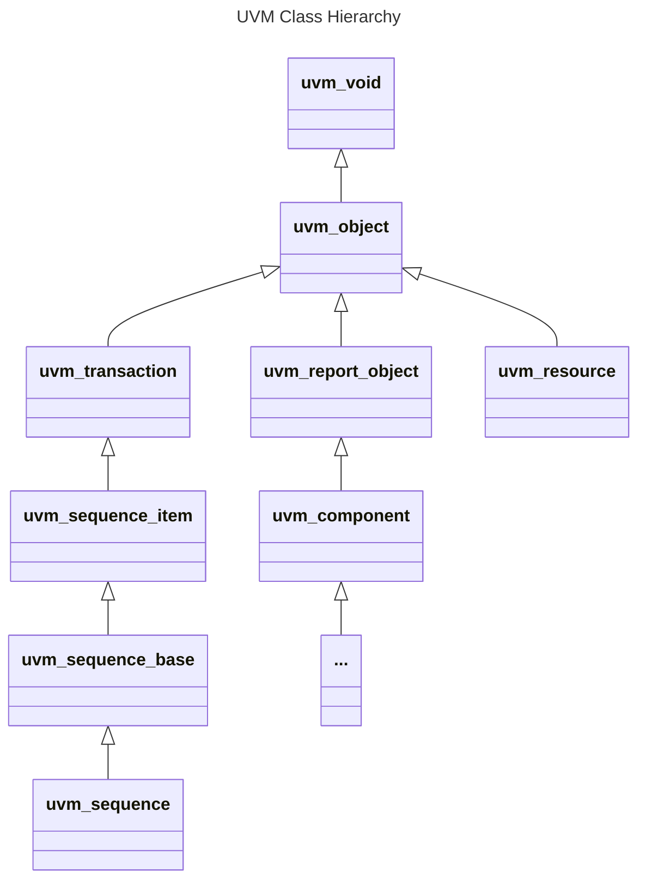
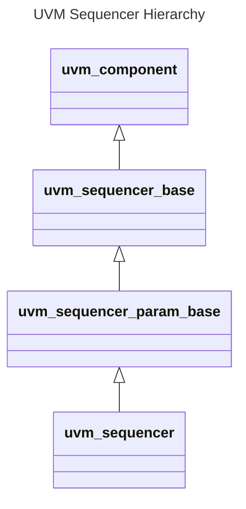

# Introduction

This note focus on the UVM application based on UVM-v1.2.


# UVM Architecture

A typical UVM verification architecture is as follows:
<!--
TODO
make a UVM architecture diagram
BY TBD9rain AT 2025-07-28 15:50
-->


## UVM Component Tree Structure

<!--
TODO
make a UVM component tree structure diagram
BY lshi1 AT 2025-07-28 23:32
-->


## Testbench

In UVM verification, the testbench major functions include:
- instantiates the DUT module and the UVM Test class
- configures connections with DUT
- starts verification with desired testcases


# UVM TLM1

The TLM1 ports provide blocking and non-blocking pass-by-value transaction-level Communications.
The semantics of these communications are limited to message passing.


## Communications

6 types of communications:
- put,
    used to send, or put transactions to other components.
- get,
    used to retrieve and consume transactions from other components.
- peek,
    used to retrieve transactions from other components without consuming.
- transport, used to send a request transaction and returns a response transaction in a task call.
- master and slave, combination of put, get, or peek.
    - master, puts requests and gets or peeks responses
    - slave, gets or peeks requests and puts responses.
- analysis, used to perform non-blocking broadcasts of transactions to connected components.


## Ports

Ports are the basis of TLM communications implementation.
3 types of ports:
- `port`,
    instantiated in components that use the associate communication to initiate transaction request.
- `export`,
    instantiated in components that forward an implementation of the methods defined in the associate communication.
- `imp`,
    instantiated by components that provide or implement methods defined in the associate communication.

Declarations of ports for put, get, peek and analysis:
```systemverilog
class uvm_*_port #(type T=int) extends uvm_port_base #(tlm_if_base #(T, T));
class uvm_*_export #(type T=int) extends uvm_port_base #(tlm_if_base #(T, T));
class uvm_*_imp #(type T=int) extends uvm_port_base #(tlm_if_base #(T, T));
```

The `*` could be one of:
- `blocking_put`
- `nonblocking_put`
- `put`
- `blocking_get`
- `nonblocking_get`
- `get`
- `blocking_peek`
- `nonblocking_peek`
- `peek`
- `blocking_get_peek`
- `nonblocking_get_peek`
- `get_peek`
- `analysis`

Declarations of ports for transport, master, and slave:
```systemverilog
class uvm_*_port #(type REQ=int, RSP=int) extends uvm_port_base #(tlm_if_base #(REQ, RSP));
class uvm_*_export #(type REQ=int, RSP=int) extends uvm_port_base #(tlm_if_base #(REQ, RSP));
class uvm_*_imp #(type REQ=int, RSP=int) extends uvm_port_base #(tlm_if_base #(REQ, RSP));
```

The `*` could be one of:
- `blocking_transport`
- `nonblocking_transport`
- `transport`
- `blocking_master`
- `nonblocking_master`
- `master`
- `blocking_slave`
- `nonblocking_slave`
- `slave`


### Port Connection

The argument of `connect()` method of `port` can be a `port`, an `export`, or an `imp` instance.
The argument of `connect()` method of `export` can be an `export`, or an `imp` instance.

Calling transmission methods of `port` will jump to the implementation method in which component the connected `imp` exists,
no matter how far up and down the hierarchy.


### Transmission Implementation Methods

When the TLM communication is blocking type,
the class instantiating `imp` should implement relevant blocking tasks.
When the TLM communication is non-blocking type,
the class instantiating `imp` should implement relevant non-blocking functions.
When the TLM communication is both blocking and non-blocking type,
the class instantiating `imp` should implement relevant both blocking and non-blocking methods.

- blocking
    - `virtual task put(input T t)`:
        sends a transaction, for `put` communication.
    - `virtual task get(output T t)`:
        obtains a transaction, for `get` and `get_peek` communication.
    - `virtual task peek(output T t)`:
        obtains a transaction without consuming, for `peek` and `get_peek` communication.
    - `virtual task transport(input REQ t1, ouput RSP t2)`:
        sends a request transaction and returns a response transaction, for `transport` communication.
- non-blocking
    - `virtual function bit try_put(input T t)`:
        tries to send a transaction, returns 1 if successes, for `put` communication.
    - `virtual function bit can_put()`:
        returns 1 if the component is ready to accept the transaction, for `put` communication.
    - `virtual function bit try_get(output T t)`:
        tries to obtain a transaction, returns 1 if successes, for `get` and `get_peek` communication.
    - `virtual function bit can_get()`:
        returns 1 if the component is ready to accept the transaction, for `get` and `get_peek` communication.
    - `virtual function bit try_peek(output T t)`:
        tries to obtain a transaction without consuming, returns 1 if successes, for `peek` and `get_peek` communication.
    - `virtual function bit can_peek()`:
        returns 1 if the component is ready to accept the transaction, for `peek` and `get_peek` communication.
    - `virtual function bit nb_transport(input REQ t1, ouput RSP t2)`:
        tries to send a request transaction and return a response transaction, return 1 if successes, for `transport` communication.
    - `virtual function bit write(input T t)`:
        broadcasts a transaction to all listeners, for `analysis` communication.


## FIFO

`uvm_tlm_fifo #(T)` provides storage of transactions between two independently running processes.
Transactions are put into the FIFO via `*_put_export` and
popped via `*_get_export`, `*_peek_export`, or `*_get_peek_export`.

Methods:
- `function new(string name, uvm_component parent = null, int size = 1)`,
    constructs the FIFO and assign name, size, parent UVM component.
- `virtual function size()`,
    returns capacity of the FIFO.
- `virtual function used()`,
    returns the number of transactions put into the FIFO.
- `virtual function is_empty()`,
    returns 1 if no transactions in the FIFO.
- `virtual function is_full()`,
    returns 1 if number of transactions equals to the `size()`.
- `virtual function flush()`,
    removes all transactions from the FIFO, reset `used()` value.

`uvm_tlm_analysis_fifo #(T)` is a `uvm_tlm_fifo #(type T)` with an unbounded size and a analysis communication.
Typical usage is as a buffer between a `uvm_analysis_port` in an initiator component and target component.

`analysis_export #(T)` provides the write method to all connected analysis ports and parent exports.

`function new(string name, uvm_component parent = null)` is the constructor.


# UVM Classes


```mermaid
---
title: UVM Class Hierarchy
---
classDiagram
    class uvm_void

    uvm_void <|-- uvm_object

    uvm_object <|-- uvm_transaction
    uvm_transaction <|-- uvm_sequence_item
    uvm_sequence_item <|-- uvm_sequence_base
    uvm_sequence_base <|-- uvm_sequence

    uvm_object <|-- uvm_report_object
    uvm_report_object <|-- uvm_component
    uvm_component <|-- `...`

    uvm_object <|-- uvm_resource
```


## UVM Transaction

The `uvm_sequence_item` declaration is as followed:
```systemverilog
class uvm_sequence_item extends uvm_transaction
```

Customized transaction class derived from `usm_sequnce_item` can utilize the field automation mechanism.
Useful automation methods include:
- `print()`
- `compare()`
- `cooy()`
- `clone()`


## UVM Sequence

The `uvm_sequence` declaration is as followed:
```systemverilog
virtual class uvm_sequence #(type REQ = uvm_sequence_item, type RSP = REQ) extends uvm_sequence_base
```

`uvm_sequence` is an `uvm_object` generating stimulus.
`uvm_sequence` can operate hierarchically with one sequence, called a parent sequence,
invoking another sequence, called a child sequence.

<!--
TODO
virtual sequence
BY lshi1 AT 2025-08-05 09:20
-->


## UVM Driver

Drivers initiate requests for new transactions form sequencers via "get" communication ports.
If needed, drivers also send responses back to the sequencers via "put" communication ports.

The `uvm_driver` declaration is as followed:
```systemverilog
class uvm_driver #(type REQ = uvm_sequence_item, type RSP = REQ) extends uvm_component
```


## UVM Sequencer


```mermaid
---
title: UVM Sequencer Hierarchy
---
classDiagram
    class uvm_component

    uvm_component <|-- uvm_sequencer_base
    uvm_sequencer_base <|-- uvm_sequencer_param_base
    uvm_sequencer_param_base <|-- uvm_sequencer
```

The `uvm_sequencer` declaration is as followed:
```systemverilog
class uvm_sequencer #(type REQ = uvm_sequence_item, type RSP = REQ) extends uvm_sequencer_param_base #(REQ, RSP)
```

`uvm_sequencer` controls the flow of "UVM Sequence Item" transactions generated in `uvm_sequence`.

<!--
TODO
virtual sequencer
BY lshi1 AT 2025-08-05 09:20
-->


## UVM Monitor

Monitors captures DUT interface signals and organizes them into transactions.
Then transmits transactions to other components like scoreboards and reference models.

The `uvm_monitor` declaration is as followed:
```systemverilog
virtual class uvm_monitor extends uvm_component
```


## UVM Agent

`uvm_agent` consists of components dealing with a specific DUT interface:
- `uvm_sequencer`
- `uvm_driver`
- `uvm_monitor`

`uvm_agent` needs to operate in "active" or "passive" mode.

The `uvm_agent` declaration is as followed:
```systemverilog
virtual class uvm_agent extends uvm_component
```


## UVM Environment

`uvm_env` groups other verification components,
including `uvm_agent`, `uvm_scoreboard`, reference model, even other auxiliary environments.

The `uvm_env` declaration is as followed:
```systemverilog
virtual class uvm_env extends uvm_component
```


## UVM Test

`uvm_test` major functions:
- instantiates `uvm_environment`
- configures `uvm_env`
- invokes testcase

Typically, there is one base UVM Test class implementing general functions.
Other individual tests will extend this base test with other testcases.

The `uvm_test` declaration is as followed:
```systemverilog
virtual class uvm_test extends uvm_component
```


## UVM Scoreboard

The major function of `uvm_scoreboard` is to check the DUT behaviors:
- receives input and output transactions from agent through analysis ports
- gets reference output transactions by either:
    - runs input transaction with reference model
    - receives expected transactions from reference model
- compares actual output transactions and expected output transactions

The `uvm_scoreboard` declaration is as followed:
```systemverilog
virtual class uvm_scoreboard extends uvm_component
```


## Reference Model

There is no specific UVM component for reference model.
To define a class as reference model, extends the `uvm_component`.


# UVM Mechanism


## Factory Mechanism


### Reload

`uvm_object` and `uvm_component` functions:
`set_type_override_by_type()`
`set_inst_override_by_type()`
`set_type_override()`
`set_inst_override()`

`factory` functions:
`factory.set_type_override_by_type()`
`factory.set_inst_override_by_type()`
`factory.set_type_override_by_name()`
`factory.set_inst_override_by_name()`

`print_override_info()`
`factory.debug_create_by_name()`
`factory.debug_create_by_type()`
`factory.print()`
`uvm_root.print_topology()`


## Configuration Mechanism


## Field Automation Mechanism


## Message Management Mechanism


# UVM Register Model


# Reuse


