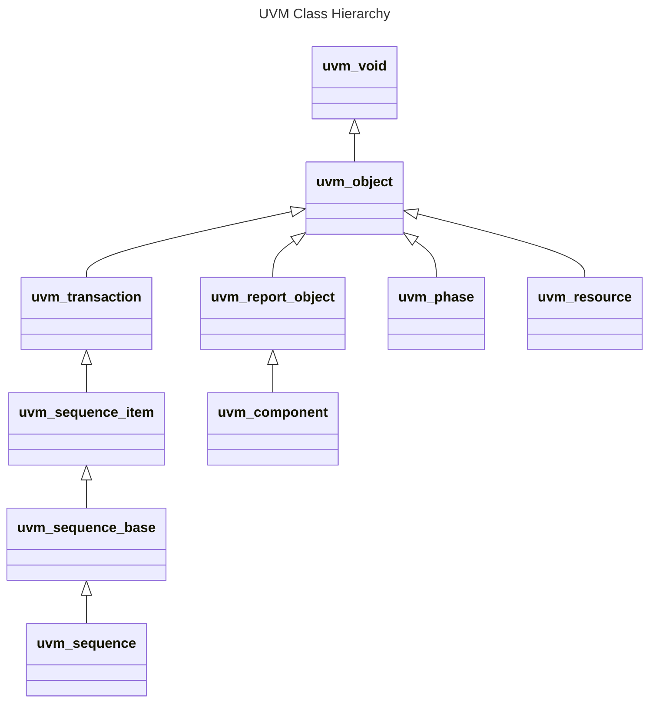
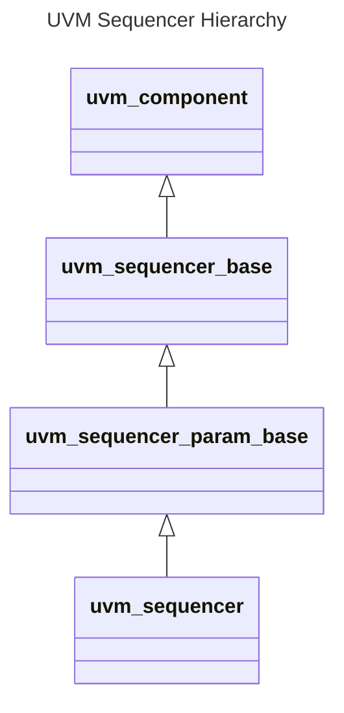
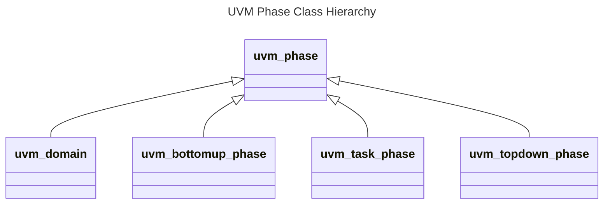

# Introduction

This note focus on the UVM application based on UVM-v1.2.


# UVM Architecture

A typical UVM verification architecture is as follows:
<!--
TODO
make a UVM architecture diagram
BY TBD9rain AT 2025-07-28 15:50
-->


## UVM Component Tree Structure

<!--
TODO
make a UVM component tree structure diagram
BY lshi1 AT 2025-07-28 23:32
-->


## Testbench

In UVM verification, the testbench major functions include:
- instantiates the DUT module and the UVM Test class
- configures connections with DUT
- starts verification with desired testcases


# UVM TLM1

The TLM1 ports provide blocking and non-blocking pass-by-value transaction-level Communications.
The semantics of these communications are limited to message passing.


## Communications

6 types of communications:
- put,
    used to send, or put transactions to other components.
- get,
    used to retrieve and consume transactions from other components.
- peek,
    used to retrieve transactions from other components without consuming.
- transport, used to send a request transaction and returns a response transaction in a task call.
- master and slave, combination of put, get, or peek.
    - master, puts requests and gets or peeks responses
    - slave, gets or peeks requests and puts responses.
- analysis, used to perform non-blocking broadcasts of transactions to connected components.


## Ports

Ports are the basis of TLM communications implementation.
3 types of ports:
- `port`,
    instantiated in components that use the associate communication to initiate transaction request.
- `export`,
    instantiated in components that forward an implementation of the methods defined in the associate communication.
- `imp`,
    instantiated by components that provide or implement methods defined in the associate communication.

Declarations of ports for put, get, peek and analysis:
```systemverilog
class uvm_*_port #(type T=int) extends uvm_port_base #(tlm_if_base #(T, T));
class uvm_*_export #(type T=int) extends uvm_port_base #(tlm_if_base #(T, T));
class uvm_*_imp #(type T=int) extends uvm_port_base #(tlm_if_base #(T, T));
```

The `*` could be one of:
- `blocking_put`
- `nonblocking_put`
- `put`
- `blocking_get`
- `nonblocking_get`
- `get`
- `blocking_peek`
- `nonblocking_peek`
- `peek`
- `blocking_get_peek`
- `nonblocking_get_peek`
- `get_peek`
- `analysis`

Declarations of ports for transport, master, and slave:
```systemverilog
class uvm_*_port #(type REQ=int, RSP=int) extends uvm_port_base #(tlm_if_base #(REQ, RSP));
class uvm_*_export #(type REQ=int, RSP=int) extends uvm_port_base #(tlm_if_base #(REQ, RSP));
class uvm_*_imp #(type REQ=int, RSP=int) extends uvm_port_base #(tlm_if_base #(REQ, RSP));
```

The `*` could be one of:
- `blocking_transport`
- `nonblocking_transport`
- `transport`
- `blocking_master`
- `nonblocking_master`
- `master`
- `blocking_slave`
- `nonblocking_slave`
- `slave`


### Port Connection

The argument of `connect()` method of `port` can be a `port`, an `export`, or an `imp` instance.
The argument of `connect()` method of `export` can be an `export`, or an `imp` instance.

Calling transmission methods of `port` will jump to the implementation method in which component the connected `imp` exists,
no matter how far up and down the hierarchy.


### Transmission Implementation Methods

When the TLM communication is blocking type,
the class instantiating `imp` should implement relevant blocking tasks.
When the TLM communication is non-blocking type,
the class instantiating `imp` should implement relevant non-blocking functions.
When the TLM communication is both blocking and non-blocking type,
the class instantiating `imp` should implement relevant both blocking and non-blocking methods.

- blocking
    - `virtual task put(input T t)`:
        sends a transaction, for `put` communication.
    - `virtual task get(output T t)`:
        obtains a transaction, for `get` and `get_peek` communication.
    - `virtual task peek(output T t)`:
        obtains a transaction without consuming, for `peek` and `get_peek` communication.
    - `virtual task transport(input REQ t1, ouput RSP t2)`:
        sends a request transaction and returns a response transaction, for `transport` communication.
- non-blocking
    - `virtual function bit try_put(input T t)`:
        tries to send a transaction, returns 1 if successes, for `put` communication.
    - `virtual function bit can_put()`:
        returns 1 if the component is ready to accept the transaction, for `put` communication.
    - `virtual function bit try_get(output T t)`:
        tries to obtain a transaction, returns 1 if successes, for `get` and `get_peek` communication.
    - `virtual function bit can_get()`:
        returns 1 if the component is ready to accept the transaction, for `get` and `get_peek` communication.
    - `virtual function bit try_peek(output T t)`:
        tries to obtain a transaction without consuming, returns 1 if successes, for `peek` and `get_peek` communication.
    - `virtual function bit can_peek()`:
        returns 1 if the component is ready to accept the transaction, for `peek` and `get_peek` communication.
    - `virtual function bit nb_transport(input REQ t1, ouput RSP t2)`:
        tries to send a request transaction and return a response transaction, return 1 if successes, for `transport` communication.
    - `virtual function bit write(input T t)`:
        broadcasts a transaction to all listeners, for `analysis` communication.


## FIFO

`uvm_tlm_fifo #(T)` provides storage of transactions between two independently running processes.
Transactions are put into the FIFO via `*_put_export` and
popped via `*_get_export`, `*_peek_export`, or `*_get_peek_export`.

Methods:
- `function new(string name, uvm_component parent = null, int size = 1)`,
    constructs the FIFO and assign name, size, parent UVM component.
- `virtual function size()`,
    returns capacity of the FIFO.
- `virtual function used()`,
    returns the number of transactions put into the FIFO.
- `virtual function is_empty()`,
    returns 1 if no transactions in the FIFO.
- `virtual function is_full()`,
    returns 1 if number of transactions equals to the `size()`.
- `virtual function flush()`,
    removes all transactions from the FIFO, reset `used()` value.

`uvm_tlm_analysis_fifo #(T)` is a `uvm_tlm_fifo #(type T)` with an unbounded size and a analysis communication.
Typical usage is as a buffer between a `uvm_analysis_port` in an initiator component and target component.

`analysis_export #(T)` provides the write method to all connected analysis ports and parent exports.

`function new(string name, uvm_component parent = null)` is the constructor.


# UVM Classes


```mermaid
---
title: UVM Class Hierarchy
---
classDiagram
    class uvm_void

    uvm_void <|-- uvm_object

    uvm_object <|-- uvm_transaction
    uvm_transaction <|-- uvm_sequence_item
    uvm_sequence_item <|-- uvm_sequence_base
    uvm_sequence_base <|-- uvm_sequence

    uvm_object <|-- uvm_report_object
    uvm_report_object <|-- uvm_component

    uvm_object <|-- uvm_phase

    uvm_object <|-- uvm_resource
```


## UVM Transaction

The `uvm_sequence_item` declaration is as followed:
```systemverilog
class uvm_sequence_item extends uvm_transaction
```

Customized transaction class derived from `usm_sequnce_item` can utilize the field automation mechanism.
Useful automation methods include:
- `print()`
- `compare()`
- `cooy()`
- `clone()`


## UVM Driver

Drivers initiate requests for new transactions form sequencers via "get" communication ports.
If needed, drivers also send responses back to the sequencers via "put" communication ports.

The `uvm_driver` declaration is as followed:
```systemverilog
class uvm_driver #(type REQ = uvm_sequence_item, type RSP = REQ) extends uvm_component
```


## UVM Monitor

Monitors captures DUT interface signals and organizes them into transactions.
Then transmits transactions to other components like scoreboards and reference models.

The `uvm_monitor` declaration is as followed:
```systemverilog
virtual class uvm_monitor extends uvm_component
```


## UVM Agent

`uvm_agent` consists of components dealing with a specific DUT interface:
- `uvm_sequencer`
- `uvm_driver`
- `uvm_monitor`

`uvm_agent` needs to operate in "active" or "passive" mode.

The `uvm_agent` declaration is as followed:
```systemverilog
virtual class uvm_agent extends uvm_component
```


## UVM Environment

`uvm_env` groups other verification components,
including `uvm_agent`, `uvm_scoreboard`, reference model, even other auxiliary environments.

The `uvm_env` declaration is as followed:
```systemverilog
virtual class uvm_env extends uvm_component
```


## UVM Sequence

The `uvm_sequence` declaration is as followed:
```systemverilog
virtual class uvm_sequence #(type REQ = uvm_sequence_item, type RSP = REQ) extends uvm_sequence_base
```

`uvm_sequence` is an `uvm_object` generating stimulus.
`uvm_sequence` can operate hierarchically with one sequence, called a parent sequence,
invoking another sequence, called a child sequence.


### Testcase Generation

`body()` is a `uvm_sequence_base` method which is inherited by `uvm_sequence`.
The testcase transactions are generated in this task with following macros:
```systemverilog
`uvm_do(SEQ_OR_ITEM)
`uvm_do_with(SEQ_OR_ITEM, CONSTRAINTS)
`uvm_do_pri(SEQ_OR_ITEM, PRIORITY)
`uvm_do_pri_with(SEQ_OR_ITEM, CONSTRAINTS, PRIORITY)
```
These macros a create transaction instance, randomize it, and send it to sequencer.
The `CONSTRAINTS` is the argument of additional randomization constraints.
The `PRIORITY` is the argument of priority for sequence arbitration in sequencer.
Default priority values are -1.


### Start Sequence

The following method task declaration in `uvm_sequence_base` is used to start sequence.
```systemverilog
virtual task start(
    uvm_sequencer_base  sequencer,
    uvm_sequence_base   parent_sequence = null,
    int                 this_priority   = -1,
    bit                 call_pre_post   = 1)
```

`sequencer` argument specifies the sequencer on which to run this sequence.
If `parent_sequence` is given, the `pre_do`, `mid_do`, and `post_do` methods of the `parent_sequence` will be called.
Otherwise, it's a root sequence.
By default, the priority is the priority of its `parent_sequence`.
For root sequence, its default priority is 100;
`call_pre_post` decides whether the `pre_body` and `post_body` will be called.


<!--
TODO
virtual sequence
BY lshi1 AT 2025-08-05 09:20
-->


## UVM Sequencer


```mermaid
---
title: UVM Sequencer Hierarchy
---
classDiagram
    class uvm_component

    uvm_component <|-- uvm_sequencer_base
    uvm_sequencer_base <|-- uvm_sequencer_param_base
    uvm_sequencer_param_base <|-- uvm_sequencer
```

The `uvm_sequencer` declaration is as followed:
```systemverilog
class uvm_sequencer #(type REQ = uvm_sequence_item, type RSP = REQ) extends uvm_sequencer_param_base #(REQ, RSP)
```

`uvm_sequencer` controls the flow of "UVM Sequence Item" transactions generated in `uvm_sequence`.


### Assign Default Sequence

The following codes could be use to define default sequence for sequencer:
```systemverilog
function void build_phase(uvm_phase phase) begin
    super.build_phase(phase);
    uvm_config_db#(uvm_object_wrapper)::set(this, <sequencer_path>,
        "default_sequence", <sequence_type>::type_id::get())
end
```

### Sequence Arbitration


<!--
TODO
virtual sequencer
BY lshi1 AT 2025-08-05 09:20
-->


## UVM Test

`uvm_test` major functions:
- instantiates `uvm_environment`
- configures `uvm_env`
- invokes testcase

Typically, there is one base UVM Test class implementing general functions.
Other individual tests will extend this base test with other testcases.

The `uvm_test` declaration is as followed:
```systemverilog
virtual class uvm_test extends uvm_component
```


## UVM Scoreboard

The major function of `uvm_scoreboard` is to check the DUT behaviors:
- receives input and output transactions from agent through analysis ports
- gets reference output transactions by either:
    - runs input transaction with reference model
    - receives expected transactions from reference model
- compares actual output transactions and expected output transactions

The `uvm_scoreboard` declaration is as followed:
```systemverilog
virtual class uvm_scoreboard extends uvm_component
```


## Reference Model

There is no specific UVM component for reference model.
To define a class as reference model, extends the `uvm_component`.


# UVM Mechanism


## Factory Mechanism

UVM provides factory mechanism to manage object generation.
Factory mechanism is advanced in object override after without code modification.
UVM objects and components need to be registered into factory before utilization.
After register, UVM objects and components could be override with factory methods.
`create()` method in factory will check whether the UVM objects and components to be created are overrode.
If overrode, the overrode type will be constructed.

To register a object or a component:
```systemverilog
`uvm_object_utils(<class_name>)
`uvm_object_param_utils(<class_name>)
OR
`uvm_component_utils(<class_name>)
`uvm_component_param_utils(<class_name>)
```
To instantiate a object registered in factory mechanism:
```systemverilog
object = <class_name>::type_id::create(<name>, <parent>)
```


### Type Override

After register, the name of the registered class will be added into a table managed by factory.
A type override table and a inst override table are managed by the factory as well.
Every time the `create()` is invoked, the inst override table will be looked up,
then the type override table, then the class table.
If a override record is found in the inst override table or the type override table,
a override type object will constructed and returned.

All type-override code should be executed in a parent prior to building the child(ren).
This means that environment overrides should be specified in the test.

Conditions must be satisfied for factory overriding:
- The original type and the override type must be registered into the factory.
- The object must be instantiated with the factory method.
- The override type must be a derived type of the original type.
- `uvm_component` and `uvm_object` can not be override with each other.

There are override methods in the `uvm_factory`, `uvm_obecjt_registry`, `uvm_component_registry`, and `uvm_component`.
It is recommended to use the override methods in the `uvm_obecjt_registry` or `uvm_component_registry`:

- `<original_type>::type_id::set_type_override(
                                                <override_type>::get_type(),
                                                bit replace=1)`<br>
This is a `uvm_component_registry` or a `uvm_object_registry` static method.
This method replaces all UVM objects or components with the new specified type.
The second argument `replace` determines whether to replace an existing override (replace = 1).
If this bit is 0 and an override of the given type does not exist, the override is registered with the factory.
If this bit is 0 and an override of the given type does exist, the override is ignored.

- `<original_type>::type_id::set_inst_override(
                                                <override_type>::get_type(),
                                                string inst_path,
                                                uvm_component parent=null)`<br>
This is a `uvm_component_registry` or a `uvm_object_registry` static method.
This method replaces the instance specified by the `inst_path`.
If parent is not specified, `inst_path` is interpreted as an absolute instance path,
which enables instance overrides to be set from outside component classes.
If parent is specified, `inst_path` is interpreted as being relative to the parent’s hierarchical instance path,
i.e. {`parent.get_full_name()`,”.”,`inst_path`} is the instance path that is registered with the override.


### Factory Debug

UVM also provides methods to debug factory mechanism:

- `print_override_info()`<br>
This is a `uvm_component` method.
It will print the original type and the derived type.

- `factory.debug_create_by_type(uvm_object_wrapper requested_type,
                                string parent_inst_path="",
                                string name="")`

- `factory.print(int all_types=1)`<br>
`all_types` could be 0 (overrode instances and types),
1 (all messages when 0 and user defined classes which are registered into factory),
or 2 (all messages when 1 and system defined classes which are registered into factory).

- `uvm_root.print_topology()`<br>
This method prints the topology of the UVM tree.
It should be invoked after build phase.


## config\_db Mechanism

config\_db mechanism is used to transfer data within a UVM test platform.
Set methods are used to send data, while get methods are used to receive data.

The invocation of the set method is as followed.
```systemverilog
uvm_config_db #(type T=int)::set(
    uvm_component cntxt,
    string inst_name,
    string field_name,
    T value);
```
The `cntxt` is usually be set as `this`,
which combines with the `inst_name` to indicate the instance path as {cntxt, ".", inst\_name}.
If `cntxt` is `null`, it will be replaced with `uvm_root::get()`

The invocation of the get method is as followed.
```systemverilog
uvm_config_db #(type T=int)::set(
    uvm_component cntxt,
    string inst_name,
    string field_name,
    inout T value);
```
The `cntxt` is usually be set as `this`, and `field_name` is usually be set as `""`.

The values of `field_name` in a set and get pair must be identical.


### config\_db Priority

The `cntxt` priority of `set()` is higher than the execution time priority:
1. The highest level of the `cntxt` has the highest priority.
2. The latest execution at the same `cntxt` level has the highest priority.


### config\_db Debug

The following `uvm_component` methods could be used to debug config\_db:
- `check_config_usage()`<br>
This method prints set and get times.
- `print_config( bit recurse=0, bit audit=0)`
If `recurse` is set, then configuration information for all children and below are printed as well.


## Phase Mechanism

The phase mechanism in UVM is a test lifecycle management system.
It organizes when and how each UVM component performs tasks during simulation.
UVM predefined a sequence of phases for UVM components to execute codes in specified stages by overriding.
Users can also customize self-defined phases.
Phase relevant class in UVM are as followed.
- `uvm_phase`<br>
The base class defining everything about a phase: behavior, state, and context.
- `uvm_domain`<br>
The base class for schedule node representing an independent branch of the schedule.
- `uvm_bottomup_phase`<br>
The virtual base class for function phases that operate bottom-up.
- `uvm_task_phase`<br>
The base class for all task phases.
- `uvm_topdown_phase`<br>
The virtual base class for function phases that operate top-down.


```mermaid
---
title: UVM Phase Class Hierarchy
---
classDiagram
    class uvm_phase

    uvm_phase <|-- uvm_domain
    uvm_phase <|-- uvm_bottomup_phase
    uvm_phase <|-- uvm_task_phase
    uvm_phase <|-- uvm_topdown_phase
```


### Common Phases

Phase entry order:
- `build_phase`
- `connect_phase`: establishes cross-component connections
- `end_of_elaboration_phase`: fine-tunes the testbench
- `start_of_simulation_phase`: gets ready for DUT to be simulated
- `run_phase`: simulates the DUT
- `extract_phase`: extracts data from different points of the verification environment
- `check_phase`: checks for any unexpected conditions in the verification environment
- `report_phase`: reports results of the test
- `final_phase`: ties up loose ends


#### Build

Class declaration:
```systemverilog
class uvm_build_phase extends uvm_topdown_phase
```

Upon entry:
- The top-level components have been instantiated under `uvm_root`
- Current simulation time is still 0 but "delta cycles" may have occurred

Typical usages:
- Instantiate sub-components
- Instantiate register model
- Get configuration values for the component being built

Exit criteria:
- All UVM components in the UVM tree have been instantiated.


#### Connect

Class declaration:
```systemverilog
class uvm_connect_phase extends uvm_bottomup_phase
```

Upon entry:
- All UVM components in the UVM tree have been instantiated
- Current simulation time is still 0 but "delta cycles" may have occurred

Typical usages:
- Connect TLM ports and exports
- Connect TLM initiator sockets and target sockets
- Connect register model to adapter components
- Setup explicit phase domains

Exit criteria:
- All cross-component connections have been established
- All independent phase domains are set


#### End of Elaboration

Class declaration:
```systemverilog
class uvm_end_of_elaboration_phase extends uvm_bottomup_phase
```

Upon entry:
- The verification environment has been completely assembled
- Current simulation time is still 0 but “delta cycles” may have occurred

Typical usages:
- Display environment topology
- Open files
- Define additional configuration setting for components

Exit criteria:
- None


#### Start of Simulation

Class declaration:
```systemverilog
class uvm_start_of_simulation_phase extends bottomup_phase
```

Upon entry:
- Other simulation engines, debuggers, hardware assisted platforms and all other run-time tools have been started and synchronized
- The verification environment has been completely configured and is ready to start
- Current simulation time is still 0 but “delta cycles” may have occurred

Typical usages:
- Display environment topology
- Set debugger breakpoints
- Set initial run-time configuration values

Exit criteria
- None


#### Run

Class declaration:
```systemverilog
class uvm_run_phase extends uvm_task_phase
```

Upon entry:
- The "power" has been applied
- There should not have been any active clock edges before entry into this phase.
- Current simulation time is still 0 but “delta cycles” may have occurred

Typical usages:
- Components implement behavior that is exhibited for the entire run-time, across the various run-time phases.

Sub-phases in run-time phase, which are extended from `uvm_task_phase`:
- `uvm_pre_reset_phase`
- `uvm_reset_phase`
- `uvm_post_reset_phase`
- `uvm_pre_configure_phase`
- `uvm_configure_phase`
- `uvm_post_configure_phase`
- `uvm_pre_main_phase`
- `uvm_main_phase`
- `uvm_post_main_phase`
- `uvm_pre_shutdown_phase`
- `uvm_shutdown_phase`
- `uvm_post_shutdown_phase`

Exit criteria:
- The DUT no longer needs to be simulated
- The `uvm_post_shutdown_phase` is ready to end

The run-phase terminates in one of two ways:
- all run-phase objections are dropped
- Timeout<br>
    By default, the timeout is set to 9200 seconds (simulation time).
    The timeout limitation may be overridden via `uvm_root::set_timeout`


##### Objection Mechanism

Objection mechanism is used to manage sub-phases in run-time phase.
Objections hold the time-consuming sub-phase functions without being killed during waiting.
If all objections that have been raised in all the same sub-phase functions of different components are dropped,
the next sub-phase will be activated.
Usually, objection can be raised and dropped in the sequence or scoreboard.

Objection relevant method declarations:
- `raise_objection(uvm_object obj, string description = "", int count = 1)`<br>
This `uvm_phase` method is used to hold the current phase running.
`obj` should be `this` in application.
`description` is informative.
`count` is the number of objection to be raised.
- `uvm_phase.drop_objection(uvm_object obj, string description = "", int count = 1)`<br>
This `uvm_phase` method is used to enable to jump to next phase.
`obj` should be `this` in application.
`description` is informative.
`count` is the number of objection to be dropped.


##### Phase Jump

Sub-phases of run-phase could jump to each other with the following method of `uvm_phase`:
- `jump(uvm_phase phase)`<br>
Use static method `get()` of Sub-phases to get input of `phase`.


#### Extract

Class declaration:
```systemverilog
class uvm_extract_phase extends uvm_bottomup_phase
```

Upon entry:
- The DUT no longer needs to be simulated
- Simulation time will no longer advance

Typical usages:
- Extract any remaining data and final data state information from the scoreboard and testbench components
- Probe the DUT for final state information
- Compute statistics and summaries
- Display final state information
- Close files

Exit criteria:
- All data has been collected and summarized


#### Check

Class declaration:
```systemverilog
class uvm_check_phase extends uvm_bottomup_phase
```

Upon entry:
- all data has been collected

Typical usages:
- Check that no unaccounted-for data remain

Exit criteria:
- Test is known to have passed or failed


#### Report

Class declaration:
```systemverilog
class uvm_report_phase extends uvm_bottomup_phase
```

Upon entry:
- Test is known to have passed or failed

Typical usages:
- Report test results
- Write results to file

Exit criteria:
- End of test


#### Final

Class declaration:
```systemverilog
class uvm_final_phase extends uvm_topdown_phase
```

Upon entry:
- All tested-related activities have completed

Typical usages:
- Close files
- Terminate co-simulation engines

Exit criteria:
- Ready to exit simulator


### Domain

Domain is used to separate sub-phases in run-phase for asynchronous sub-phase progress controlling.
The function phases and the run-phase are still synchronized among different domains.
Relevant methods:
- `new(string name)`<br>
This is the constructor method of `uvm_domain`.
- `set_domain(uvm_domain domain, int hier=1)`<br>
This is the domain setting method in `uvm_component`
The `hier` indicates whether to set the domain recursively.

Phase jumping could only be used in the same domain.


## Field Automation Mechanism

Field automation mechanism is used to apply predefined functions with customized variables.
Variables of a object or a components have to be register before using field automation macros:
```systemverilog
`uvm_object_utils_begin(<object_name>) OR `uvm_object_param_utils_begin(<object_name>)
<varaible_register>
if (<condition>) begin
    <varaible_register>
end
<varaible_register>
`uvm_object_utils_end

`uvm_component_utils_begin(<object_name>) OR `uvm_component_param_utils_begin(<object_name>)
<varaible_register>
if (<condition>) begin
    <varaible_register>
end
<varaible_register>
`uvm_component_utils_end
```

The if statements determine whether the variable register macros are included.
The condition can be a expression based on variables in the class.

### Field Automation Functions

The simplest variable register macros include:
```systemverilog
define `uvm_field_int(ARG, FLAG)
define `uvm_field_real(ARG, FLAG)
define `uvm_field_enum(T, ARG, FLAG)
define `uvm_field_object(ARG, FLAG)
define `uvm_field_event(ARG, FLAG)
define `uvm_field_string(ARG, FLAG)
```
Other variable register macros are for fixed array, dynamic array, queue, and associative array.

After register, the following functions with default behaviors are available:
- `fucntion void copy (uvm_object rhs)`
- `fucntion bit compare (uvm_object rhs, uvm_comparer comparer=null)`
- `function int pack_bytes (ref byte unsigned bytestream[], input uvm_packer packer=null)`<br>
This function packs all fields into byte stream.
- `function int unpack_bytes (ref byte unsigned bytestream[], input uvm_packer packer=null)`<br>
This function unpack the given byte stream into the fields.
- `function int pack (ref bit unsigned bitstream[], input uvm_packer packer=null)`
- `function int unpack (ref bit unsigned bitstream[], input uvm_packer packer=null)`
- `function int pack_ints (ref int unsigned intstream[], input uvm_packer packer=null)`
- `function int unpack_ints (ref int unsigned intstream[], input uvm_packer packer=null)`
- `function void print()`
- `function uvm_object clone()`


### Flags

In `uvm_component`, field automation could automatically obtain data from `config_db::set` without `config_db::get`.

The `FLAG` argument of the variable register macro defines whether the variable is allowed to use the default functions.
The alternative flags includes `UVM_ALL_ON`, `UVM_COPY`, `UVM_NO_COPY`, and etc.
Flags can be combined with the `|` character.


## Message Management Mechanism

There are four kinds of message print macros with different severities:
```systemverilog
`uvm_info(ID, MSG, VERBOSITY)
`uvm_warning(ID, MSG)
`uvm_error(ID, MSG)
`uvm_fatal(ID, MSG)
```
`ID` is a string as the tag of the message, which is usually the name of the class.
`MSG` is a string as the message text.
`VERBOSITY` is the verbosity level of the message.


### Severity

Message severity variable is a `uvm_severity` enumerate type:
```systemverilog
UVM_INFO        //  informative
UVM_WARNING     //  indicates a potential problem
UVM_ERROR       //  indicates a actual problem
UVM_FATAL       //  indicates a critical problem, simulation exits after a #0 delay
```

The following methods of `uvm_report_object` override message severities:
- `set_report_severity_override(uvm_severity cur_severity, uvm_severity new_severity)`
- `set_report_severity_id_override(uvm_severity cur_severity, string id, uvm_severity new_severity)`


### Verbosity

`verbosity_level()` is a component method, which returns the verbosity of the invoking component.
It returns an integer which corresponds to the verbosity enum:
```systemverilog
typedef enum
{
    UVM_NONE    = 0,
    UVM_LOW     = 100,
    UVM_MEDIUM  = 200,
    UVM_HIGH    = 300,
    UVM_FULL    = 400,
    UVM_DEBUG   = 500
} uvm_verbosity;
```

The messages whose verbosity is less than the verbosity level will be printed.

The following `uvm_report_object` methods set message verbosity:
- `set_report_verbosity_level(int verbosity)`<br>
- `set_report_id_verbosity(string id, int verbosity)`<br>

The following `uvm_component` methods set message verbosity recursively:
- `set_report_verbosity_level_hier(int verbosity)`<br>
- `set_report_id_verbosity_hier(string id, int verbosity)`<br>


### Action

Message action variable is a `uvm_action` enumerate type:
```systemverilog
UVM_NO_ACTION
UVM_DISPLAY
UVM_LOG
UVM_COUNT       //  counts the number of reports for max_quit_count

UVM_EXIT
UVM_CALL_HOOK   //  callbacks the report hook methods
UVM_STOP

UVM_RM_RECORD   //  sends the report to the recorder
```

The following methods of `uvm_report_object` set message actions:
- `set_report_severity_action(uvm_severity severity, uvm_action action)`
- `set_report_id_action(string id, uvm_action action)`
- `set_report_severity_id_action(uvm_severity severity, string id, uvm_action action)`

The following methods of `uvm_component` set message actions recursively:
- `set_report_severity_action_hier(uvm_severity severity, uvm_action action)`
- `set_report_id_action_hier(string id, uvm_action action)`
- `set_report_severity_id_action_hier(uvm_severity severity, string id, uvm_action action)`

The action argument can be a combination of `uvm_action` with `|` character.


### Log

To enable message log:
1. open a file with `w` argument as log file
2. set the log file for messages
3. enable message log action

The following methods of `uvm_report_object` set log file for messages:
- `set_report_default_file(UVM_FILE file)`
- `set_report_id_file(string id, UVM_FILE file)`
- `set_report_severity_file(uvm_severity severity, UVM_FILE file)`
- `set_report_severity_id_file(uvm_severity severity, string id, UVM_FILE file)`

The following methods of `uvm_component` set log file for messages recursively:
- `set_report_default_file_hier(UVM_FILE file)`
- `set_report_id_file_hier(string id, UVM_FILE file)`
- `set_report_severity_file_hier(uvm_severity severity, UVM_FILE file)`
- `set_report_severity_id_file_hier(uvm_severity severity, string id, UVM_FILE file)`


# UVM Register Model


